# Architectural Patterns for Low-Level Design

> Architectural patterns define the high-level structure of your code at the component level.
> In LLD interviews, these patterns show you can organize code beyond individual classes.

---

## Table of Contents

1. [Dependency Injection (DI)](#1-dependency-injection-di)
2. [Repository Pattern](#2-repository-pattern)
3. [Service Layer Pattern](#3-service-layer-pattern)
4. [DAO (Data Access Object) Pattern](#4-dao-data-access-object-pattern)
5. [MVC / MVP / MVVM](#5-mvc--mvp--mvvm)
6. [Layered Architecture](#6-layered-architecture)
7. [Clean Architecture / Hexagonal Architecture](#7-clean-architecture--hexagonal-architecture)
8. [Event-Driven Architecture at Component Level](#8-event-driven-architecture-at-component-level)
9. [Interview Questions](#9-interview-questions)

---

## 1. Dependency Injection (DI)

### What Is Dependency Injection?

Dependency Injection is a technique where an object receives its dependencies from **external sources** rather than creating them internally. It is one concrete implementation of the **Inversion of Control (IoC)** principle.

**Without DI** — the class creates its own dependencies:
```python
class OrderService:
    def __init__(self):
        self.payment = StripePaymentGateway()  # Hardcoded dependency
        self.inventory = MySQLInventoryService()  # Hardcoded dependency
```

**With DI** — dependencies are passed in:
```python
class OrderService:
    def __init__(self, payment: PaymentGateway, inventory: InventoryService):
        self.payment = payment  # Injected
        self.inventory = inventory  # Injected
```

### Why DI Matters

| Without DI | With DI |
|------------|---------|
| Classes tightly coupled to concrete implementations | Classes depend on abstractions |
| Hard to unit test (cannot mock dependencies) | Easy to test (inject mocks) |
| Changing a dependency requires modifying the class | Swap dependencies without changing the class |
| Violates Open/Closed Principle | Follows SOLID principles |
| Cannot reuse class with different implementations | Highly reusable |

### Inversion of Control (IoC) Explained

Traditional control flow: **your code** calls library code.
Inverted control flow: **framework code** calls your code (and provides dependencies).

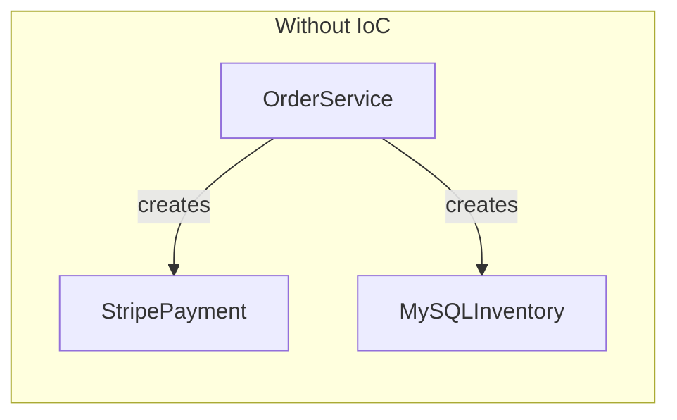

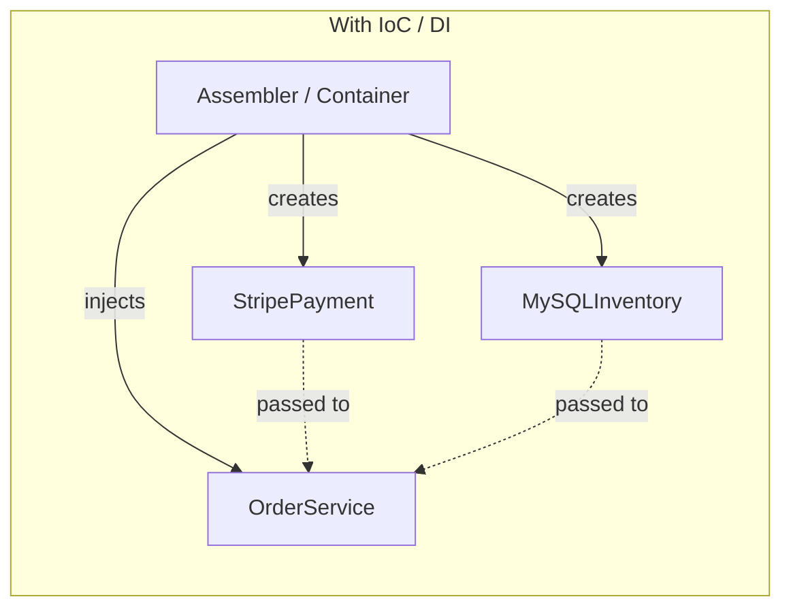

---

### 1.1 Constructor Injection (Preferred)

Dependencies are provided through the constructor. This is the **most recommended** form because:
- Dependencies are clearly visible
- Object is fully initialized after construction
- Makes required dependencies explicit

**Python:**
```python
from abc import ABC, abstractmethod

class EmailSender(ABC):
    @abstractmethod
    def send(self, to: str, message: str) -> bool:
        pass

class SMSSender(ABC):
    @abstractmethod
    def send(self, phone: str, message: str) -> bool:
        pass

class NotificationService:
    """Dependencies injected via constructor."""
    def __init__(self, email_sender: EmailSender, sms_sender: SMSSender):
        self._email_sender = email_sender
        self._sms_sender = sms_sender

    def notify_user(self, user, message: str):
        if user.email:
            self._email_sender.send(user.email, message)
        if user.phone:
            self._sms_sender.send(user.phone, message)
```

**Java:**
```java
public interface PaymentGateway {
    PaymentResult charge(Money amount, CardDetails card);
}

public interface InventoryService {
    boolean reserve(String productId, int quantity);
}

public class OrderService {
    private final PaymentGateway paymentGateway;
    private final InventoryService inventoryService;

    // Constructor Injection
    public OrderService(PaymentGateway paymentGateway,
                        InventoryService inventoryService) {
        this.paymentGateway = paymentGateway;
        this.inventoryService = inventoryService;
    }

    public Order placeOrder(Cart cart) {
        inventoryService.reserve(cart.getProductId(), cart.getQuantity());
        paymentGateway.charge(cart.getTotal(), cart.getCardDetails());
        return new Order(cart, OrderStatus.CONFIRMED);
    }
}
```

---

### 1.2 Setter Injection

Dependencies are provided through setter methods. Useful for **optional** dependencies.

**Python:**
```python
class ReportGenerator:
    def __init__(self):
        self._formatter = None  # Optional dependency
        self._exporter = None

    def set_formatter(self, formatter: Formatter):
        self._formatter = formatter

    def set_exporter(self, exporter: Exporter):
        self._exporter = exporter

    def generate(self, data):
        formatted = self._formatter.format(data) if self._formatter else str(data)
        if self._exporter:
            self._exporter.export(formatted)
        return formatted
```

**Java:**
```java
public class ReportGenerator {
    private Formatter formatter;
    private Exporter exporter;

    // Setter Injection
    public void setFormatter(Formatter formatter) {
        this.formatter = formatter;
    }

    public void setExporter(Exporter exporter) {
        this.exporter = exporter;
    }
}
```

**Drawback:** Object can be in an incomplete state if setters are not called.

---

### 1.3 Interface Injection

The dependency provides an injector method that the client must implement.

```python
from abc import ABC, abstractmethod

class LoggerInjector(ABC):
    @abstractmethod
    def inject_logger(self, logger: 'Logger'):
        pass

class UserService(LoggerInjector):
    def inject_logger(self, logger: 'Logger'):
        self._logger = logger

    def create_user(self, name: str):
        self._logger.log(f"Creating user: {name}")
```

This is the **least common** form. It adds coupling through the injector interface.

---

### 1.4 Service Locator Pattern (Anti-Pattern)

A Service Locator is a registry that provides dependencies on demand. Classes ask the locator for what they need.

```python
class ServiceLocator:
    _services = {}

    @classmethod
    def register(cls, name: str, service):
        cls._services[name] = service

    @classmethod
    def get(cls, name: str):
        return cls._services.get(name)

class OrderService:
    def place_order(self, cart):
        # Asks the locator — dependency is HIDDEN
        payment = ServiceLocator.get("payment_gateway")
        payment.charge(cart.total)
```

**Why it is often an anti-pattern:**

| Service Locator | Dependency Injection |
|-----------------|---------------------|
| Dependencies hidden inside methods | Dependencies visible in constructor |
| Hard to know what a class needs | Constructor signature tells you |
| Harder to test (must set up locator) | Pass mocks directly |
| Runtime errors if service not registered | Compile-time / instantiation-time errors |
| Global mutable state | No global state needed |

**Use Service Locator only when:** you are working with legacy code or plugin systems where DI is impractical.

---

### 1.5 DI Container Concepts

A DI Container (IoC Container) automates dependency resolution. You register types, and the container creates object graphs.

```python
class DIContainer:
    """Simplified DI container."""
    def __init__(self):
        self._registry = {}

    def register(self, interface, implementation, singleton=False):
        self._registry[interface] = {
            'impl': implementation,
            'singleton': singleton,
            'instance': None
        }

    def resolve(self, interface):
        entry = self._registry.get(interface)
        if entry is None:
            raise ValueError(f"No registration for {interface}")

        if entry['singleton'] and entry['instance']:
            return entry['instance']

        # Auto-resolve constructor dependencies
        import inspect
        sig = inspect.signature(entry['impl'].__init__)
        deps = {}
        for name, param in sig.parameters.items():
            if name == 'self':
                continue
            if param.annotation in self._registry:
                deps[name] = self.resolve(param.annotation)

        instance = entry['impl'](**deps)
        if entry['singleton']:
            entry['instance'] = instance
        return instance

# Usage
container = DIContainer()
container.register(PaymentGateway, StripePaymentGateway, singleton=True)
container.register(InventoryService, WarehouseInventoryService)
container.register(OrderService, OrderService)

order_service = container.resolve(OrderService)  # Auto-wired!
```

**Real-world DI Frameworks:**
- **Java:** Spring Framework, Google Guice, Dagger
- **Python:** dependency-injector, injector
- **C#:** Microsoft.Extensions.DependencyInjection, Autofac
- **JavaScript/TypeScript:** InversifyJS, tsyringe

---

### Full DI Example: NotificationService

```python
from abc import ABC, abstractmethod

# --- Abstractions ---
class MessageSender(ABC):
    @abstractmethod
    def send(self, recipient: str, message: str) -> bool:
        pass

# --- Concrete Implementations ---
class EmailSender(MessageSender):
    def send(self, recipient: str, message: str) -> bool:
        print(f"[EMAIL] To: {recipient} | {message}")
        return True

class SMSSender(MessageSender):
    def send(self, recipient: str, message: str) -> bool:
        print(f"[SMS] To: {recipient} | {message}")
        return True

class PushNotificationSender(MessageSender):
    def send(self, recipient: str, message: str) -> bool:
        print(f"[PUSH] To: {recipient} | {message}")
        return True

# --- Service with injected dependencies ---
class NotificationService:
    def __init__(self, senders: list[MessageSender]):
        self._senders = senders

    def notify(self, recipient: str, message: str):
        for sender in self._senders:
            sender.send(recipient, message)

# --- Composition Root (where we wire everything) ---
def main():
    senders = [EmailSender(), SMSSender(), PushNotificationSender()]
    service = NotificationService(senders)
    service.notify("user@example.com", "Your order has shipped!")

    # For testing — inject mocks instead:
    # mock_sender = MockSender()
    # test_service = NotificationService([mock_sender])
```

### Full DI Example: OrderService

```python
from abc import ABC, abstractmethod
from dataclasses import dataclass
from enum import Enum

class OrderStatus(Enum):
    PENDING = "pending"
    CONFIRMED = "confirmed"
    FAILED = "failed"

@dataclass
class Order:
    order_id: str
    total: float
    status: OrderStatus

# --- Abstractions ---
class PaymentGateway(ABC):
    @abstractmethod
    def charge(self, amount: float, card_token: str) -> bool:
        pass

class InventoryService(ABC):
    @abstractmethod
    def reserve(self, product_id: str, qty: int) -> bool:
        pass

class OrderRepository(ABC):
    @abstractmethod
    def save(self, order: Order) -> None:
        pass

# --- Service with Constructor Injection ---
class OrderService:
    def __init__(
        self,
        payment: PaymentGateway,
        inventory: InventoryService,
        repo: OrderRepository
    ):
        self._payment = payment
        self._inventory = inventory
        self._repo = repo

    def place_order(self, product_id: str, qty: int,
                    amount: float, card_token: str) -> Order:
        if not self._inventory.reserve(product_id, qty):
            return Order("", amount, OrderStatus.FAILED)

        if not self._payment.charge(amount, card_token):
            return Order("", amount, OrderStatus.FAILED)

        order = Order(order_id="ORD-001", total=amount,
                      status=OrderStatus.CONFIRMED)
        self._repo.save(order)
        return order
```

---

## 2. Repository Pattern

### What Is the Repository Pattern?

The Repository pattern mediates between the **domain layer** and the **data mapping layer**. It provides a collection-like interface for accessing domain objects, hiding the details of data access.

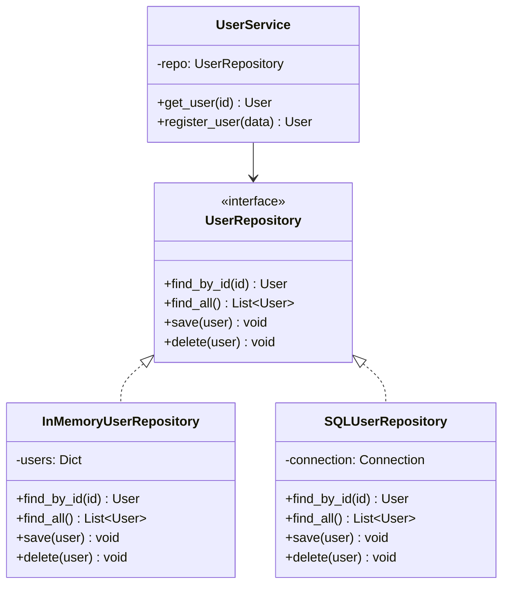

### Python Implementation

```python
from abc import ABC, abstractmethod
from dataclasses import dataclass
from typing import Optional

@dataclass
class User:
    user_id: str
    name: str
    email: str

class UserRepository(ABC):
    @abstractmethod
    def find_by_id(self, user_id: str) -> Optional[User]:
        pass

    @abstractmethod
    def find_all(self) -> list[User]:
        pass

    @abstractmethod
    def save(self, user: User) -> None:
        pass

    @abstractmethod
    def delete(self, user_id: str) -> None:
        pass

# --- In-Memory Implementation (for testing) ---
class InMemoryUserRepository(UserRepository):
    def __init__(self):
        self._store: dict[str, User] = {}

    def find_by_id(self, user_id: str) -> Optional[User]:
        return self._store.get(user_id)

    def find_all(self) -> list[User]:
        return list(self._store.values())

    def save(self, user: User) -> None:
        self._store[user.user_id] = user

    def delete(self, user_id: str) -> None:
        self._store.pop(user_id, None)

# --- SQL Implementation (production) ---
class SQLUserRepository(UserRepository):
    def __init__(self, connection):
        self._conn = connection

    def find_by_id(self, user_id: str) -> Optional[User]:
        cursor = self._conn.execute(
            "SELECT id, name, email FROM users WHERE id = ?", (user_id,)
        )
        row = cursor.fetchone()
        return User(*row) if row else None

    def find_all(self) -> list[User]:
        cursor = self._conn.execute("SELECT id, name, email FROM users")
        return [User(*row) for row in cursor.fetchall()]

    def save(self, user: User) -> None:
        self._conn.execute(
            "INSERT OR REPLACE INTO users VALUES (?, ?, ?)",
            (user.user_id, user.name, user.email)
        )

    def delete(self, user_id: str) -> None:
        self._conn.execute("DELETE FROM users WHERE id = ?", (user_id,))
```

**Java:**
```java
public interface UserRepository {
    Optional<User> findById(String userId);
    List<User> findAll();
    void save(User user);
    void delete(String userId);
    List<User> findByEmail(String email);  // Domain-specific query
}
```

### When to Use Repository

| Use Repository | Use Direct DB Access |
|---------------|---------------------|
| Business logic is complex | Simple CRUD with no logic |
| Need testability (inject in-memory repo) | Prototype / throwaway code |
| Multiple data sources possible | Single, fixed data source |
| Domain model differs from DB schema | 1:1 mapping to tables |

---

## 3. Service Layer Pattern

### What Is the Service Layer?

The Service Layer defines an application's boundary and set of available operations. It encapsulates **business logic** and coordinates between the domain model and infrastructure.

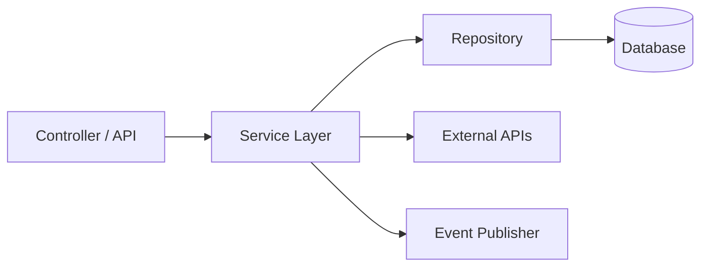

### Python Implementation

```python
class OrderService:
    """Service layer encapsulating order business logic."""

    def __init__(self, order_repo: OrderRepository,
                 product_repo: ProductRepository,
                 payment_gateway: PaymentGateway,
                 notification_service: NotificationService):
        self._order_repo = order_repo
        self._product_repo = product_repo
        self._payment = payment_gateway
        self._notification = notification_service

    def place_order(self, user_id: str, items: list[OrderItem]) -> Order:
        # 1. Validate products exist and are in stock
        for item in items:
            product = self._product_repo.find_by_id(item.product_id)
            if not product or product.stock < item.quantity:
                raise InsufficientStockError(item.product_id)

        # 2. Calculate total
        total = sum(
            self._product_repo.find_by_id(i.product_id).price * i.quantity
            for i in items
        )

        # 3. Process payment
        payment_result = self._payment.charge(user_id, total)
        if not payment_result.success:
            raise PaymentFailedError(payment_result.error)

        # 4. Create order
        order = Order(user_id=user_id, items=items,
                      total=total, status=OrderStatus.CONFIRMED)
        self._order_repo.save(order)

        # 5. Update stock
        for item in items:
            self._product_repo.decrement_stock(item.product_id, item.quantity)

        # 6. Send notification
        self._notification.notify(user_id, f"Order {order.id} confirmed!")

        return order

    def cancel_order(self, order_id: str) -> Order:
        order = self._order_repo.find_by_id(order_id)
        if not order:
            raise OrderNotFoundError(order_id)
        if order.status != OrderStatus.CONFIRMED:
            raise InvalidOperationError("Cannot cancel non-confirmed order")

        order.status = OrderStatus.CANCELLED
        self._payment.refund(order.payment_id)
        self._order_repo.save(order)
        return order
```

### Rules of the Service Layer

1. **Orchestrates** but does not contain low-level data access code
2. **Calls repositories** for persistence operations
3. **Coordinates** multiple domain objects and external services
4. **Handles transactions** (begin, commit, rollback)
5. **Thin controllers** delegate to services; services contain the logic

---

## 4. DAO (Data Access Object) Pattern

### What Is DAO?

The DAO pattern provides an abstract interface to a specific type of database or persistence mechanism. It isolates the data access logic from business logic.

### Python Implementation

```python
from abc import ABC, abstractmethod

class UserDAO(ABC):
    """Low-level data access operations for User table."""

    @abstractmethod
    def insert(self, user_data: dict) -> int:
        pass

    @abstractmethod
    def update(self, user_id: int, user_data: dict) -> bool:
        pass

    @abstractmethod
    def select_by_id(self, user_id: int) -> dict:
        pass

    @abstractmethod
    def delete(self, user_id: int) -> bool:
        pass

    @abstractmethod
    def select_where(self, conditions: dict) -> list[dict]:
        pass

class MySQLUserDAO(UserDAO):
    def __init__(self, connection):
        self._conn = connection

    def insert(self, user_data: dict) -> int:
        cols = ", ".join(user_data.keys())
        vals = ", ".join(["%s"] * len(user_data))
        sql = f"INSERT INTO users ({cols}) VALUES ({vals})"
        cursor = self._conn.execute(sql, list(user_data.values()))
        return cursor.lastrowid

    def update(self, user_id: int, user_data: dict) -> bool:
        sets = ", ".join(f"{k} = %s" for k in user_data)
        sql = f"UPDATE users SET {sets} WHERE id = %s"
        self._conn.execute(sql, list(user_data.values()) + [user_id])
        return True

    def select_by_id(self, user_id: int) -> dict:
        cursor = self._conn.execute(
            "SELECT * FROM users WHERE id = %s", (user_id,)
        )
        return cursor.fetchone()

    def delete(self, user_id: int) -> bool:
        self._conn.execute("DELETE FROM users WHERE id = %s", (user_id,))
        return True

    def select_where(self, conditions: dict) -> list[dict]:
        where = " AND ".join(f"{k} = %s" for k in conditions)
        sql = f"SELECT * FROM users WHERE {where}"
        cursor = self._conn.execute(sql, list(conditions.values()))
        return cursor.fetchall()
```

**Java:**
```java
public interface UserDAO {
    int insert(Map<String, Object> userData);
    boolean update(int userId, Map<String, Object> userData);
    Map<String, Object> selectById(int userId);
    boolean delete(int userId);
    List<Map<String, Object>> selectWhere(Map<String, Object> conditions);
}
```

### Repository vs DAO Comparison

| Aspect | Repository | DAO |
|--------|-----------|-----|
| **Abstraction level** | Domain-oriented (returns domain objects) | Data-oriented (returns raw data / DTOs) |
| **Interface language** | Domain language: `findActiveUsers()` | SQL-like: `selectWhere({"active": true})` |
| **Scope** | Can aggregate multiple data sources | Typically one table / data source |
| **Belongs to** | Domain layer | Data access layer |
| **Returns** | Domain entities (`User` object) | Raw data (`dict`, `ResultSet`) |
| **Can use** | DAOs internally | Standalone |
| **Complexity** | Higher — may combine multiple DAOs | Lower — maps to single table |

**In practice:** Repository often wraps one or more DAOs, translating raw data into domain objects.

---

## 5. MVC / MVP / MVVM

### 5.1 MVC (Model-View-Controller)

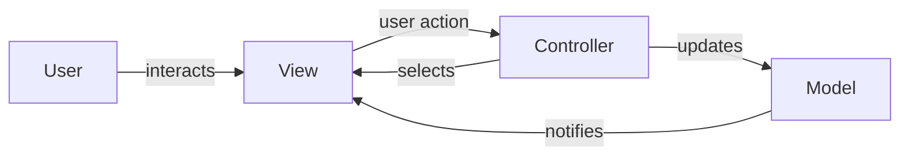

**Components:**
- **Model:** Data and business logic
- **View:** Presentation / UI rendering
- **Controller:** Handles user input, orchestrates Model and View

**Python Example:**
```python
# Model
class TaskModel:
    def __init__(self):
        self.tasks = []

    def add_task(self, task: str):
        self.tasks.append({"text": task, "done": False})

    def complete_task(self, index: int):
        self.tasks[index]["done"] = True

    def get_tasks(self) -> list:
        return self.tasks

# View
class TaskView:
    def display_tasks(self, tasks: list):
        for i, task in enumerate(tasks):
            status = "[x]" if task["done"] else "[ ]"
            print(f"  {i}. {status} {task['text']}")

    def get_input(self) -> str:
        return input("Enter task: ")

# Controller
class TaskController:
    def __init__(self, model: TaskModel, view: TaskView):
        self.model = model
        self.view = view

    def add_task(self):
        task_text = self.view.get_input()
        self.model.add_task(task_text)
        self.view.display_tasks(self.model.get_tasks())

    def complete_task(self, index: int):
        self.model.complete_task(index)
        self.view.display_tasks(self.model.get_tasks())
```

---

### 5.2 MVP (Model-View-Presenter)

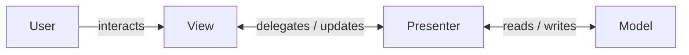

**Key difference from MVC:** The View does NOT communicate directly with the Model. The Presenter acts as a middleman for all interactions.

```python
# View Interface
class TaskViewInterface(ABC):
    @abstractmethod
    def show_tasks(self, tasks: list): pass

    @abstractmethod
    def get_task_input(self) -> str: pass

    @abstractmethod
    def show_error(self, message: str): pass

# Presenter
class TaskPresenter:
    def __init__(self, model: TaskModel, view: TaskViewInterface):
        self.model = model
        self.view = view

    def on_add_clicked(self):
        text = self.view.get_task_input()
        if not text.strip():
            self.view.show_error("Task cannot be empty")
            return
        self.model.add_task(text)
        self.view.show_tasks(self.model.get_tasks())
```

---

### 5.3 MVVM (Model-View-ViewModel)

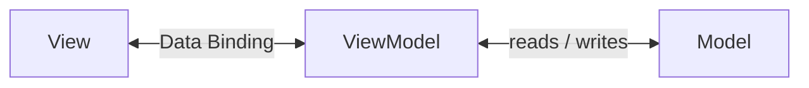

**Key concept: Data Binding.** The View automatically updates when ViewModel properties change. No manual `view.update()` calls.

```python
class Observable:
    """Simple observable for data binding."""
    def __init__(self, value=None):
        self._value = value
        self._listeners = []

    @property
    def value(self):
        return self._value

    @value.setter
    def value(self, new_value):
        self._value = new_value
        for listener in self._listeners:
            listener(new_value)

    def bind(self, callback):
        self._listeners.append(callback)

class TaskViewModel:
    def __init__(self, model: TaskModel):
        self._model = model
        self.tasks = Observable([])
        self.error_message = Observable("")

    def add_task(self, text: str):
        if not text.strip():
            self.error_message.value = "Task cannot be empty"
            return
        self._model.add_task(text)
        self.tasks.value = self._model.get_tasks()  # Triggers UI update
```

### MVC vs MVP vs MVVM Comparison

| Aspect | MVC | MVP | MVVM |
|--------|-----|-----|------|
| **View-Model link** | View observes Model directly | View and Model fully separated | View binds to ViewModel |
| **Controller/Presenter role** | Routes input, selects view | Middleman for all logic | Exposes bindable state |
| **Testability** | Moderate | High (mock view interface) | High (test ViewModel alone) |
| **View logic** | Some logic in View | View is passive / "dumb" | View is declarative |
| **Data flow** | Triangular | Linear through Presenter | Two-way binding |
| **Complexity** | Low | Medium | Medium-High |

**Framework Usage:**

| Pattern | Frameworks |
|---------|-----------|
| MVC | Django, Ruby on Rails, Spring MVC, ASP.NET MVC |
| MVP | Android (traditional), GWT, Swing |
| MVVM | Android Jetpack, SwiftUI, WPF, Vue.js, Angular |

---

## 6. Layered Architecture

### The Classic Four Layers

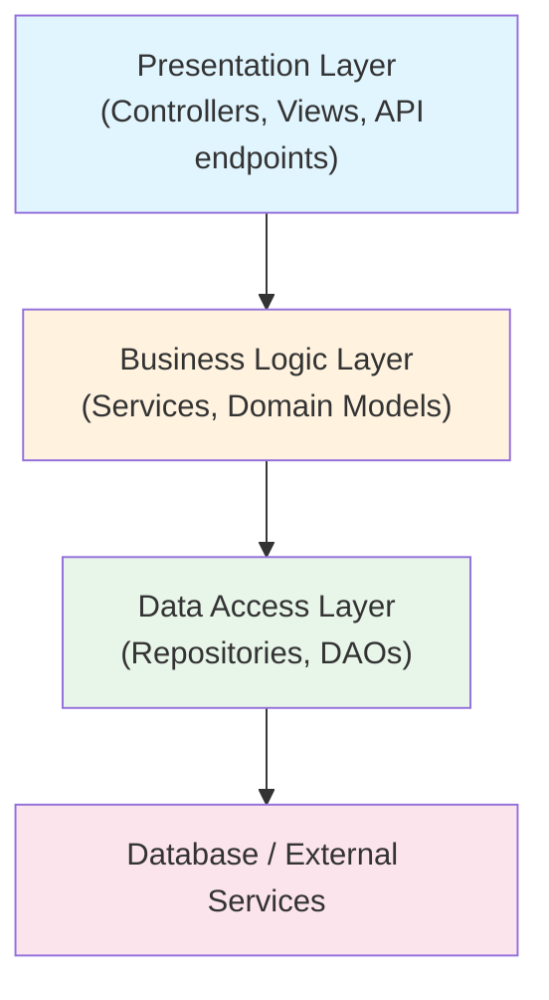

### Rules

1. **Each layer only communicates with the layer directly below it** (no skipping layers)
2. **Upper layers depend on lower layers** (never the reverse)
3. **Each layer has a clear responsibility**

### Python Code Showing Proper Layering

```python
# --- Data Access Layer ---
class ProductRepository:
    def find_by_id(self, product_id: str) -> Product:
        # Database query logic
        pass

    def save(self, product: Product) -> None:
        # Database insert/update logic
        pass

# --- Business Logic Layer ---
class ProductService:
    def __init__(self, product_repo: ProductRepository,
                 pricing_engine: PricingEngine):
        self._repo = product_repo
        self._pricing = pricing_engine

    def get_product_with_price(self, product_id: str,
                                user_tier: str) -> ProductDTO:
        product = self._repo.find_by_id(product_id)
        price = self._pricing.calculate(product, user_tier)
        return ProductDTO(product.name, price)

# --- Presentation Layer ---
class ProductController:
    def __init__(self, product_service: ProductService):
        self._service = product_service

    def get_product(self, request):
        product_id = request.path_params["id"]
        user_tier = request.user.tier
        dto = self._service.get_product_with_price(product_id, user_tier)
        return JsonResponse({"name": dto.name, "price": dto.price})
```

### Layer Violations to Avoid

```python
# BAD: Controller directly accesses database (skips layers)
class ProductController:
    def get_product(self, request):
        cursor = db.execute("SELECT * FROM products WHERE id = ?", (id,))
        return JsonResponse(cursor.fetchone())

# BAD: Repository contains business logic
class ProductRepository:
    def find_discounted_products(self, user_tier):
        products = self.find_all()
        return [p for p in products if self._calculate_discount(p, user_tier)]
```

---

## 7. Clean Architecture / Hexagonal Architecture

### Clean Architecture (Uncle Bob)

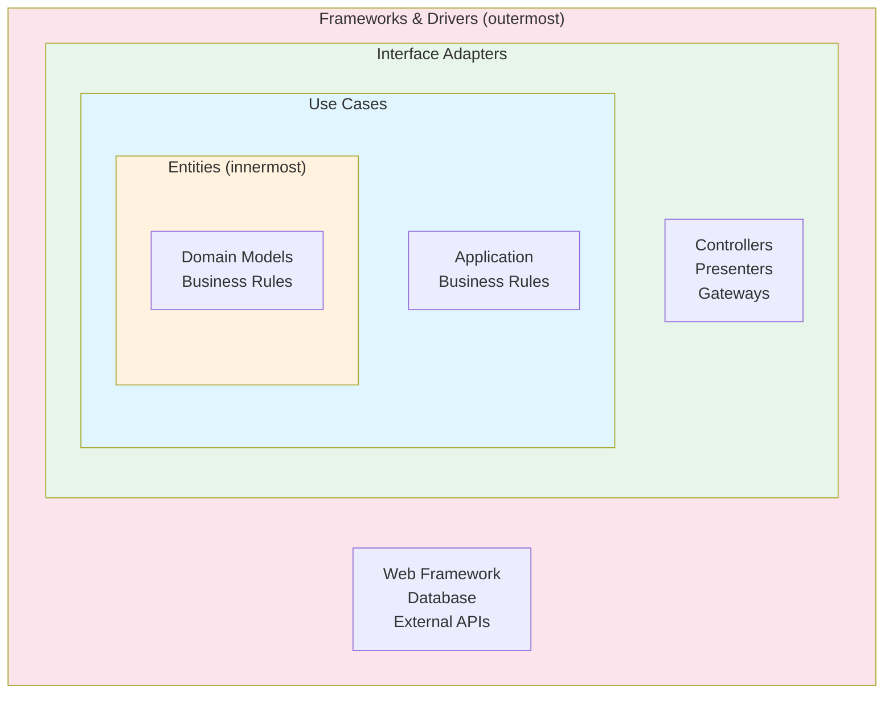

**The Dependency Rule:** Source code dependencies always point **inward**. Inner layers know nothing about outer layers.

### Hexagonal Architecture (Ports and Adapters)

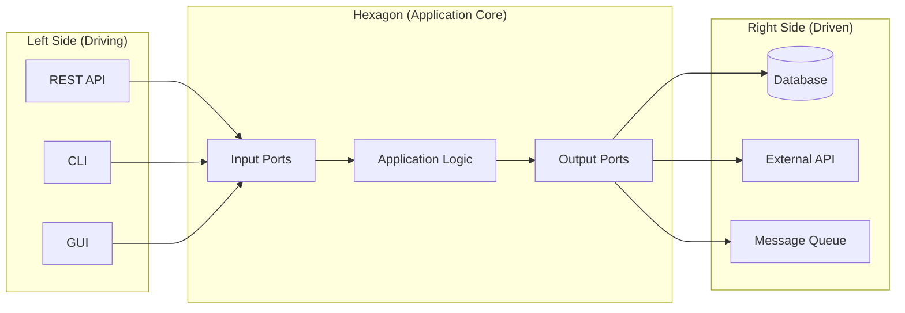

**Concepts:**
- **Ports:** Interfaces defined by the application core (e.g., `UserRepository`, `PaymentGateway`)
- **Adapters:** Implementations that connect to external systems (e.g., `PostgresUserRepository`, `StripePaymentGateway`)
- **Driving adapters** (left): Trigger application actions (REST controller, CLI)
- **Driven adapters** (right): Called by the application (database, APIs)

```python
# PORT (interface defined by domain)
class OrderPort(ABC):
    @abstractmethod
    def place_order(self, items: list, user_id: str) -> Order:
        pass

# APPLICATION CORE (uses ports)
class OrderUseCase(OrderPort):
    def __init__(self, repo: OrderRepositoryPort, payment: PaymentPort):
        self._repo = repo
        self._payment = payment

    def place_order(self, items, user_id) -> Order:
        order = Order(items=items, user_id=user_id)
        self._payment.charge(order.total)
        self._repo.save(order)
        return order

# ADAPTER (connects to external system)
class FastAPIOrderAdapter:
    def __init__(self, use_case: OrderPort):
        self._use_case = use_case

    def handle_post(self, request):
        order = self._use_case.place_order(request.items, request.user_id)
        return {"order_id": order.id, "status": order.status}
```

---

## 8. Event-Driven Architecture at Component Level

### 8.1 Event Bus Pattern

An Event Bus is a central hub that receives events and dispatches them to registered handlers.

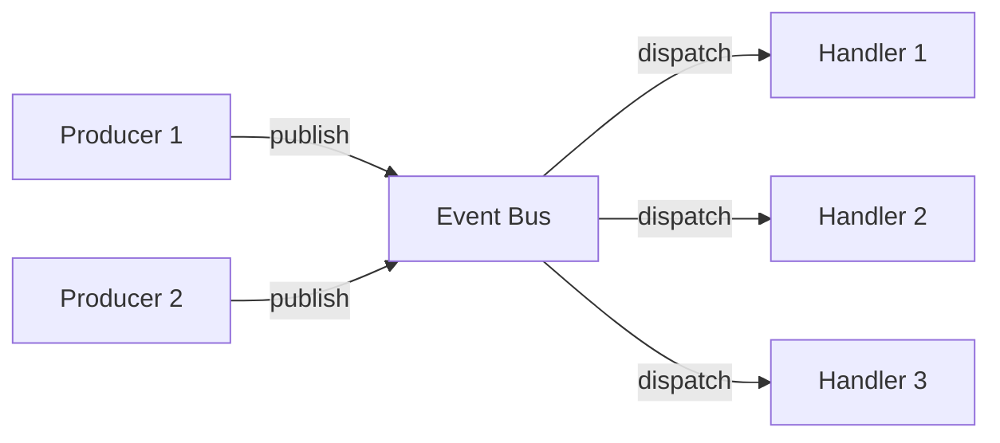

```python
from collections import defaultdict
from typing import Callable
from dataclasses import dataclass

@dataclass
class Event:
    event_type: str
    data: dict

class EventBus:
    def __init__(self):
        self._handlers: dict[str, list[Callable]] = defaultdict(list)

    def subscribe(self, event_type: str, handler: Callable):
        self._handlers[event_type].append(handler)

    def publish(self, event: Event):
        for handler in self._handlers.get(event.event_type, []):
            handler(event)

# Usage
bus = EventBus()

def send_welcome_email(event: Event):
    print(f"Sending welcome email to {event.data['email']}")

def create_default_settings(event: Event):
    print(f"Creating settings for user {event.data['user_id']}")

bus.subscribe("user_registered", send_welcome_email)
bus.subscribe("user_registered", create_default_settings)

bus.publish(Event("user_registered", {"user_id": "123", "email": "a@b.com"}))
```

---

### 8.2 Pub-Sub vs Observer: Detailed Comparison

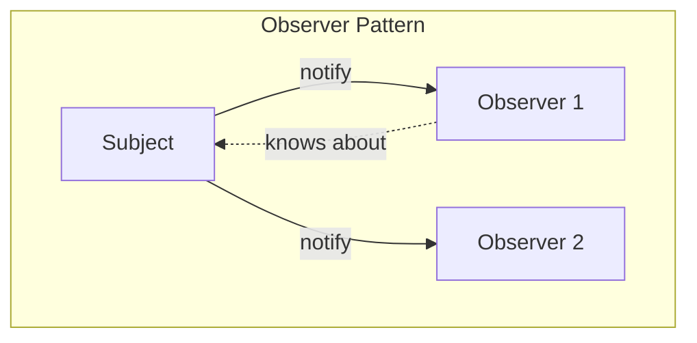

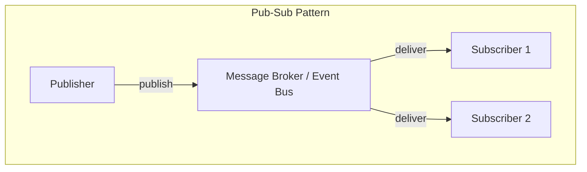

| Aspect | Observer | Pub-Sub |
|--------|----------|---------|
| **Coupling** | Subject knows its observers directly | Publisher and subscriber are decoupled |
| **Mediator** | No intermediary | Message broker / event bus in between |
| **Communication** | Synchronous (usually) | Can be async |
| **Filtering** | Observers receive ALL notifications | Subscribers filter by topic/type |
| **Scale** | Same process | Can span processes / services |
| **Example** | GUI button click handlers | Kafka, RabbitMQ, Event Bus |

**Observer Code:**
```python
class Subject:
    def __init__(self):
        self._observers = []

    def attach(self, observer):
        self._observers.append(observer)

    def notify(self, data):
        for obs in self._observers:
            obs.update(data)  # Direct call — tightly coupled
```

**Pub-Sub Code:**
```python
class EventBus:
    def __init__(self):
        self._topics = defaultdict(list)

    def subscribe(self, topic: str, callback):
        self._topics[topic].append(callback)

    def publish(self, topic: str, data):
        for callback in self._topics.get(topic, []):
            callback(data)  # Decoupled — publisher doesn't know subscribers
```

---

### 8.3 Event Sourcing Basics

Instead of storing **current state**, store **every event** that led to the current state.

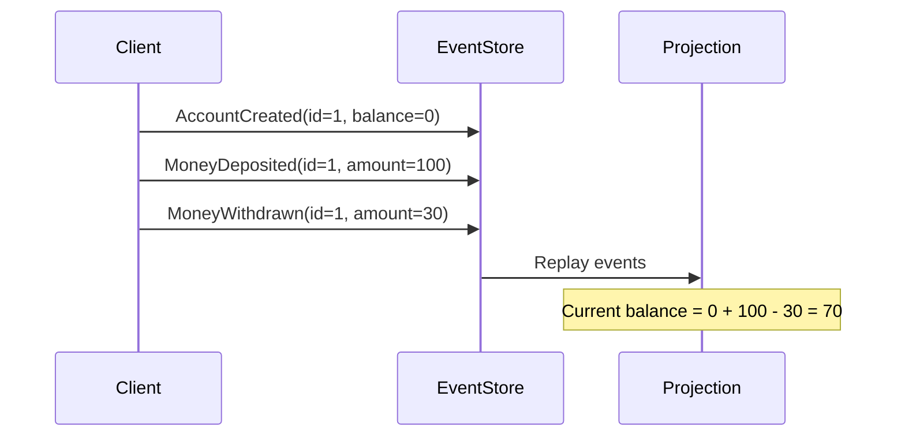

```python
@dataclass
class DomainEvent:
    event_type: str
    data: dict
    timestamp: float

class BankAccount:
    def __init__(self):
        self.balance = 0
        self._events: list[DomainEvent] = []

    def apply_event(self, event: DomainEvent):
        if event.event_type == "deposited":
            self.balance += event.data["amount"]
        elif event.event_type == "withdrawn":
            self.balance -= event.data["amount"]
        self._events.append(event)

    def deposit(self, amount: float):
        event = DomainEvent("deposited", {"amount": amount}, time.time())
        self.apply_event(event)

    def withdraw(self, amount: float):
        if amount > self.balance:
            raise ValueError("Insufficient funds")
        event = DomainEvent("withdrawn", {"amount": amount}, time.time())
        self.apply_event(event)

    @classmethod
    def from_events(cls, events: list[DomainEvent]) -> 'BankAccount':
        account = cls()
        for event in events:
            account.apply_event(event)
        return account
```

**Benefits:** Complete audit trail, ability to replay/rebuild state, temporal queries.
**Drawbacks:** Complexity, eventual consistency, storage growth.

---

### 8.4 CQRS (Command Query Responsibility Segregation)

Separate the **read model** from the **write model**.

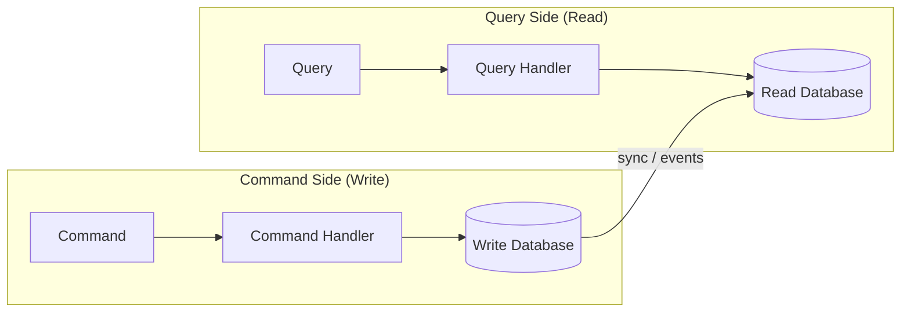

```python
# --- Command Side ---
@dataclass
class CreateOrderCommand:
    user_id: str
    items: list
    total: float

class CreateOrderHandler:
    def __init__(self, write_repo: OrderWriteRepository):
        self._repo = write_repo

    def handle(self, command: CreateOrderCommand):
        order = Order(
            user_id=command.user_id,
            items=command.items,
            total=command.total,
            status=OrderStatus.CONFIRMED
        )
        self._repo.save(order)

# --- Query Side ---
@dataclass
class GetOrdersByUserQuery:
    user_id: str

class GetOrdersByUserHandler:
    def __init__(self, read_repo: OrderReadRepository):
        self._repo = read_repo

    def handle(self, query: GetOrdersByUserQuery) -> list[OrderSummaryDTO]:
        return self._repo.find_orders_by_user(query.user_id)
```

**When to use CQRS:**
- Read and write workloads have very different performance requirements
- Read model needs denormalized views for fast queries
- Combined with Event Sourcing for complex domains

---

## 9. Interview Questions

### Dependency Injection

1. **What is Dependency Injection? How does it relate to the Dependency Inversion Principle?**
   - DI is a technique; DIP is the SOLID principle. DI is one way to achieve DIP.

2. **What are the three types of DI? Which do you prefer and why?**
   - Constructor, Setter, Interface. Constructor is preferred (explicit, immutable, complete initialization).

3. **Why is Service Locator considered an anti-pattern?**
   - Hides dependencies, makes testing harder, creates global state.

4. **How does DI improve testability?**
   - Allows injecting mocks/stubs instead of real implementations.

5. **Design a notification system using DI.**
   - See the NotificationService example above.

### Architectural Patterns

6. **What is the Repository pattern? How does it differ from DAO?**
   - Repository is domain-oriented, returns domain objects. DAO is data-oriented, maps to tables.

7. **Explain the Service Layer pattern. What belongs in a service vs. a controller?**
   - Service: business logic, transaction management, orchestration. Controller: HTTP handling, request parsing, response formatting.

8. **Compare MVC, MVP, and MVVM. When would you choose each?**
   - See the comparison table above.

9. **What is the Dependency Rule in Clean Architecture?**
   - Source code dependencies must only point inward. Inner layers must not know about outer layers.

10. **Compare Observer pattern with Pub-Sub. When would you use each?**
    - Observer: same-process, direct coupling OK. Pub-Sub: need decoupling, cross-process, topic-based filtering.

11. **What is CQRS? When is it overkill?**
    - Separate read/write models. Overkill for simple CRUD apps with similar read/write patterns.

12. **What is Event Sourcing? What are its trade-offs?**
    - Store events instead of state. Pro: audit trail, rebuild. Con: complexity, storage, eventual consistency.

13. **Design an e-commerce order system using layered architecture. Show the layers.**
    - Controller (API) -> OrderService (business logic) -> OrderRepository (data access) -> Database

14. **How do Ports and Adapters help with testing?**
    - Ports define interfaces. For testing, use in-memory adapters instead of real database/API adapters.

15. **In an LLD interview, you designed a Parking Lot. How would you layer the code?**
    - Model: ParkingSpot, Vehicle, Ticket. Service: ParkingService (assign spots, calculate fees). Repository: SpotRepository, TicketRepository. Controller: ParkingController (REST endpoints).

---

## Quick Reference

| Pattern | Purpose | Key Benefit |
|---------|---------|-------------|
| **Dependency Injection** | Decouple creation from usage | Testability + flexibility |
| **Repository** | Abstract data access with domain interface | Swap data sources easily |
| **Service Layer** | Encapsulate business logic | Clean separation of concerns |
| **DAO** | Low-level data access abstraction | Database independence |
| **MVC** | Separate UI, logic, data | Organized web applications |
| **MVP** | Separate UI from logic completely | Testable presenters |
| **MVVM** | Bind UI to data model | Reactive UIs |
| **Layered** | Organize code in horizontal layers | Clear responsibilities |
| **Clean/Hexagonal** | Isolate core from infrastructure | Framework independence |
| **Event Bus** | Decouple event producers/consumers | Loose coupling |
| **Event Sourcing** | Store events, not state | Full audit trail |
| **CQRS** | Separate read and write models | Optimized queries |
