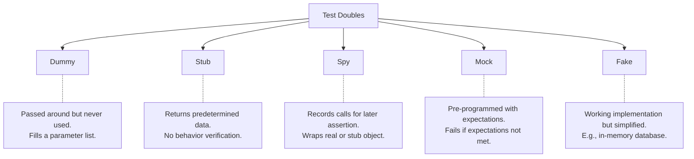
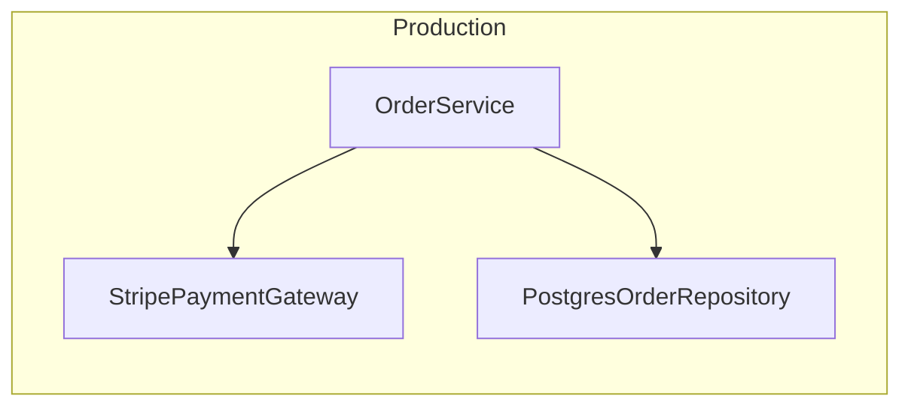
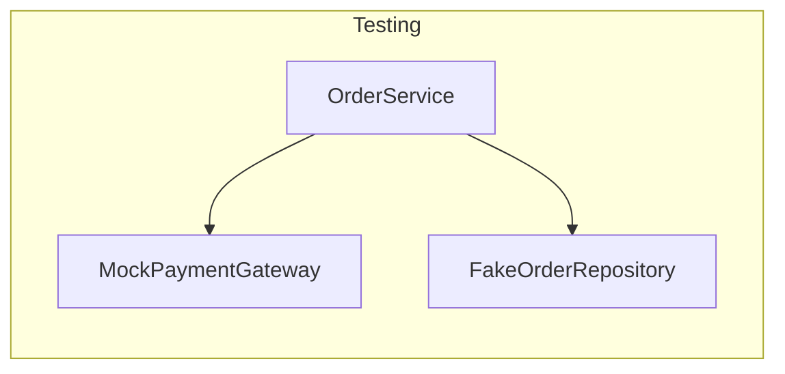
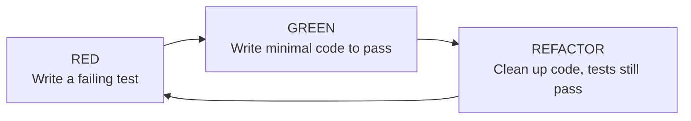

# Testing Patterns for Low-Level Design

> Testing is not an afterthought — it is a design tool. Well-designed code is testable code.
> In LLD interviews, demonstrating awareness of testing shows engineering maturity.

---

## Table of Contents

1. [Unit Testing Fundamentals](#1-unit-testing-fundamentals)
2. [Test Doubles](#2-test-doubles)
3. [Mocking Strategies](#3-mocking-strategies)
4. [Test-Driven Development (TDD)](#4-test-driven-development-tdd)
5. [Testing Design Patterns](#5-testing-design-patterns)
6. [How Testing Relates to SOLID](#6-how-testing-relates-to-solid)
7. [Interview Questions](#7-interview-questions)

---

## 1. Unit Testing Fundamentals

### What Makes a Good Unit Test?

A good unit test follows the **FIRST** principles:

| Principle | Meaning |
|-----------|---------|
| **F**ast | Runs in milliseconds, no I/O |
| **I**ndependent | Does not depend on other tests or execution order |
| **R**epeatable | Same result every time, no external dependencies |
| **S**elf-validating | Pass or fail with no manual inspection |
| **T**imely | Written close to the production code |

### AAA Pattern: Arrange, Act, Assert

Every unit test should have three clear sections:

```python
def test_add_item_to_cart():
    # Arrange — set up the objects and data
    cart = ShoppingCart()
    product = Product("Widget", price=9.99)

    # Act — perform the action being tested
    cart.add_item(product, quantity=2)

    # Assert — verify the expected outcome
    assert cart.total == 19.98
    assert cart.item_count == 2
```

### Python: unittest

```python
import unittest

class Calculator:
    def add(self, a: float, b: float) -> float:
        return a + b

    def divide(self, a: float, b: float) -> float:
        if b == 0:
            raise ValueError("Cannot divide by zero")
        return a / b

class TestCalculator(unittest.TestCase):
    def setUp(self):
        """Runs before each test method."""
        self.calc = Calculator()

    def test_add_positive_numbers(self):
        result = self.calc.add(2, 3)
        self.assertEqual(result, 5)

    def test_add_negative_numbers(self):
        result = self.calc.add(-1, -2)
        self.assertEqual(result, -3)

    def test_divide_normal(self):
        result = self.calc.divide(10, 2)
        self.assertEqual(result, 5.0)

    def test_divide_by_zero_raises(self):
        with self.assertRaises(ValueError):
            self.calc.divide(10, 0)

    def tearDown(self):
        """Runs after each test method."""
        pass

if __name__ == "__main__":
    unittest.main()
```

### Python: pytest (Preferred)

```python
import pytest

class TestCalculator:
    def setup_method(self):
        self.calc = Calculator()

    def test_add_positive(self):
        assert self.calc.add(2, 3) == 5

    def test_add_floats(self):
        assert self.calc.add(0.1, 0.2) == pytest.approx(0.3)

    def test_divide_by_zero(self):
        with pytest.raises(ValueError, match="Cannot divide by zero"):
            self.calc.divide(10, 0)

# Parametrized tests — test many inputs at once
@pytest.mark.parametrize("a, b, expected", [
    (1, 1, 2),
    (0, 0, 0),
    (-1, 1, 0),
    (100, 200, 300),
])
def test_add(a, b, expected):
    calc = Calculator()
    assert calc.add(a, b) == expected
```

### Java: JUnit 5

```java
import org.junit.jupiter.api.*;
import static org.junit.jupiter.api.Assertions.*;

class CalculatorTest {
    private Calculator calc;

    @BeforeEach
    void setUp() {
        calc = new Calculator();
    }

    @Test
    @DisplayName("Adding two positive numbers")
    void testAddPositive() {
        assertEquals(5, calc.add(2, 3));
    }

    @Test
    @DisplayName("Division by zero throws exception")
    void testDivideByZero() {
        assertThrows(ArithmeticException.class,
            () -> calc.divide(10, 0));
    }
}
```

### Test Naming Conventions

Use names that describe the **scenario** and **expected outcome**:

| Style | Example |
|-------|---------|
| `test_<method>_<scenario>_<expected>` | `test_withdraw_insufficient_funds_raises_error` |
| `should_<expected>_when_<scenario>` | `should_raise_error_when_insufficient_funds` |
| `given_<state>_when_<action>_then_<outcome>` | `given_empty_cart_when_checkout_then_raises_error` |

---

## 2. Test Doubles

Test doubles are objects that **stand in** for real dependencies during testing.

### The Five Types



### Comparison Table

| Type | Purpose | Has Logic? | Verifies Calls? | Example |
|------|---------|-----------|-----------------|---------|
| **Dummy** | Fill parameter requirements | No | No | `NullLogger()` passed to constructor |
| **Stub** | Provide canned answers | Minimal | No | `StubPaymentGateway` always returns success |
| **Spy** | Record interactions | No | Yes (after the fact) | Spy that counts how many emails were sent |
| **Mock** | Verify expected interactions | No | Yes (expectations set upfront) | Mock that expects `charge()` called once with $50 |
| **Fake** | Lightweight working implementation | Yes | No | `InMemoryUserRepository` instead of SQL |

### Python Examples

```python
from abc import ABC, abstractmethod

class Logger(ABC):
    @abstractmethod
    def log(self, message: str): pass

# DUMMY — exists only to satisfy a parameter
class DummyLogger(Logger):
    def log(self, message: str):
        pass  # Does nothing

# STUB — returns predetermined data
class StubPaymentGateway:
    def charge(self, amount: float) -> bool:
        return True  # Always succeeds

class StubPaymentGatewayFailing:
    def charge(self, amount: float) -> bool:
        return False  # Always fails

# SPY — records interactions
class SpyEmailSender:
    def __init__(self):
        self.sent_emails = []

    def send(self, to: str, subject: str, body: str):
        self.sent_emails.append({"to": to, "subject": subject, "body": body})

# Usage:
spy = SpyEmailSender()
service = NotificationService(spy)
service.notify_user(user, "Hello")
assert len(spy.sent_emails) == 1
assert spy.sent_emails[0]["to"] == "user@example.com"

# FAKE — working lightweight implementation
class FakeUserRepository:
    def __init__(self):
        self._store = {}

    def save(self, user):
        self._store[user.id] = user

    def find_by_id(self, user_id):
        return self._store.get(user_id)

# MOCK — using unittest.mock
from unittest.mock import Mock, MagicMock

mock_gateway = Mock()
mock_gateway.charge.return_value = True

order_service = OrderService(payment=mock_gateway)
order_service.place_order(cart)

mock_gateway.charge.assert_called_once_with(99.99)
```

### When to Use Which

| Scenario | Use |
|----------|-----|
| Parameter required but not relevant to test | **Dummy** |
| Need specific return values from a dependency | **Stub** |
| Need to verify a method was called correctly | **Mock** |
| Need to check what happened after the fact | **Spy** |
| Need a working but simple alternative | **Fake** |

---

## 3. Mocking Strategies

### Python: unittest.mock

```python
from unittest.mock import Mock, MagicMock, patch, PropertyMock

# --- Mock basics ---
mock = Mock()
mock.some_method.return_value = 42
result = mock.some_method("arg1")  # Returns 42

mock.some_method.assert_called_once_with("arg1")

# --- MagicMock (supports magic methods) ---
magic = MagicMock()
magic.__len__.return_value = 5
len(magic)  # Returns 5

# --- Side effects ---
mock.method.side_effect = ValueError("Something went wrong")
# mock.method()  # Raises ValueError

mock.method.side_effect = [1, 2, 3]
# mock.method()  # Returns 1, then 2, then 3

# --- patch decorator ---
@patch('mymodule.ExternalAPI')
def test_service(mock_api_class):
    mock_api = mock_api_class.return_value
    mock_api.fetch_data.return_value = {"status": "ok"}

    service = MyService()
    result = service.process()

    mock_api.fetch_data.assert_called_once()
```

### Mocking External Dependencies

#### Testing PaymentService by Mocking PaymentGateway

```python
from unittest.mock import Mock
import pytest

class PaymentGateway(ABC):
    @abstractmethod
    def charge(self, card_token: str, amount: float) -> dict:
        pass

class PaymentService:
    def __init__(self, gateway: PaymentGateway):
        self._gateway = gateway

    def process_payment(self, card_token: str, amount: float) -> str:
        if amount <= 0:
            raise ValueError("Amount must be positive")

        result = self._gateway.charge(card_token, amount)
        if result["status"] == "success":
            return result["transaction_id"]
        else:
            raise PaymentFailedError(result["error"])

class TestPaymentService:
    def setup_method(self):
        self.mock_gateway = Mock(spec=PaymentGateway)
        self.service = PaymentService(self.mock_gateway)

    def test_successful_payment(self):
        # Arrange
        self.mock_gateway.charge.return_value = {
            "status": "success",
            "transaction_id": "TXN-123"
        }

        # Act
        txn_id = self.service.process_payment("card_abc", 50.00)

        # Assert
        assert txn_id == "TXN-123"
        self.mock_gateway.charge.assert_called_once_with("card_abc", 50.00)

    def test_failed_payment(self):
        self.mock_gateway.charge.return_value = {
            "status": "failed",
            "error": "Insufficient funds"
        }

        with pytest.raises(PaymentFailedError):
            self.service.process_payment("card_abc", 50.00)

    def test_negative_amount_raises(self):
        with pytest.raises(ValueError, match="Amount must be positive"):
            self.service.process_payment("card_abc", -10)

        # Gateway should NOT be called for invalid amounts
        self.mock_gateway.charge.assert_not_called()
```

#### Testing UserService by Mocking UserRepository

```python
class TestUserService:
    def setup_method(self):
        self.mock_repo = Mock(spec=UserRepository)
        self.mock_hasher = Mock(spec=PasswordHasher)
        self.service = UserService(self.mock_repo, self.mock_hasher)

    def test_register_new_user(self):
        # Arrange
        self.mock_repo.find_by_email.return_value = None
        self.mock_hasher.hash.return_value = "hashed_password"

        # Act
        user = self.service.register("alice@example.com", "password123")

        # Assert
        assert user.email == "alice@example.com"
        self.mock_repo.save.assert_called_once()
        self.mock_hasher.hash.assert_called_once_with("password123")

    def test_register_duplicate_email_raises(self):
        self.mock_repo.find_by_email.return_value = User(
            id="1", email="alice@example.com"
        )

        with pytest.raises(DuplicateEmailError):
            self.service.register("alice@example.com", "password123")

        self.mock_repo.save.assert_not_called()
```

### Mocking with Interfaces (DI Makes Testing Easy)





The class under test is identical in both cases. Only the injected dependencies change.

---

## 4. Test-Driven Development (TDD)

### Red, Green, Refactor



1. **RED:** Write a test for the next piece of functionality. Run it. It fails.
2. **GREEN:** Write the **minimum** code needed to make the test pass.
3. **REFACTOR:** Improve the code without changing behavior. Tests still pass.

### Full TDD Example: Build a Stack

**Step 1 (RED) — Test that a new stack is empty:**
```python
def test_new_stack_is_empty():
    stack = Stack()
    assert stack.is_empty() is True
```

**Step 1 (GREEN) — Minimal implementation:**
```python
class Stack:
    def is_empty(self):
        return True
```

**Step 2 (RED) — Test push and not empty:**
```python
def test_stack_not_empty_after_push():
    stack = Stack()
    stack.push(42)
    assert stack.is_empty() is False
```

**Step 2 (GREEN):**
```python
class Stack:
    def __init__(self):
        self._items = []

    def is_empty(self):
        return len(self._items) == 0

    def push(self, item):
        self._items.append(item)
```

**Step 3 (RED) — Test pop returns last pushed item:**
```python
def test_pop_returns_last_pushed():
    stack = Stack()
    stack.push(1)
    stack.push(2)
    assert stack.pop() == 2
```

**Step 3 (GREEN):**
```python
def pop(self):
    return self._items.pop()
```

**Step 4 (RED) — Test pop on empty stack raises error:**
```python
def test_pop_empty_raises():
    stack = Stack()
    with pytest.raises(IndexError, match="pop from empty stack"):
        stack.pop()
```

**Step 4 (GREEN):**
```python
def pop(self):
    if self.is_empty():
        raise IndexError("pop from empty stack")
    return self._items.pop()
```

**Step 5 (RED) — Test peek:**
```python
def test_peek_returns_top_without_removing():
    stack = Stack()
    stack.push(10)
    assert stack.peek() == 10
    assert stack.is_empty() is False  # Still there
```

**Step 5 (GREEN):**
```python
def peek(self):
    if self.is_empty():
        raise IndexError("peek at empty stack")
    return self._items[-1]
```

**REFACTOR:** Add `__len__`, `__repr__`, clean up.

### Why TDD Helps LLD Design

| Benefit | How |
|---------|-----|
| Forces you to define interfaces first | You write tests against interfaces before implementation |
| Prevents over-engineering | You only write code needed to pass tests |
| Ensures testable design | If it's hard to test, the design needs work |
| Documents expected behavior | Tests serve as executable specification |
| Catches regressions | Existing tests break when you introduce bugs |

---

## 5. Testing Design Patterns

### 5.1 Object Mother Pattern

A factory that creates pre-configured test objects:

```python
class UserMother:
    """Creates common test User configurations."""

    @staticmethod
    def admin() -> User:
        return User(id="1", name="Admin", email="admin@test.com",
                    role=Role.ADMIN, active=True)

    @staticmethod
    def regular_user() -> User:
        return User(id="2", name="Alice", email="alice@test.com",
                    role=Role.USER, active=True)

    @staticmethod
    def inactive_user() -> User:
        return User(id="3", name="Bob", email="bob@test.com",
                    role=Role.USER, active=False)

    @staticmethod
    def with_email(email: str) -> User:
        return User(id="99", name="Custom", email=email,
                    role=Role.USER, active=True)

# Usage in tests
def test_admin_can_delete_users():
    admin = UserMother.admin()
    target = UserMother.regular_user()
    service = UserService(FakeUserRepo())
    service.delete_user(admin, target.id)
```

### 5.2 Builder Pattern for Test Data

When test objects have many fields:

```python
class OrderBuilder:
    def __init__(self):
        self._order_id = "ORD-001"
        self._user_id = "USR-001"
        self._items = []
        self._total = 0.0
        self._status = OrderStatus.PENDING

    def with_id(self, order_id: str) -> 'OrderBuilder':
        self._order_id = order_id
        return self

    def with_user(self, user_id: str) -> 'OrderBuilder':
        self._user_id = user_id
        return self

    def with_item(self, product: str, qty: int, price: float) -> 'OrderBuilder':
        self._items.append(OrderItem(product, qty, price))
        self._total += qty * price
        return self

    def with_status(self, status: OrderStatus) -> 'OrderBuilder':
        self._status = status
        return self

    def build(self) -> Order:
        return Order(
            order_id=self._order_id,
            user_id=self._user_id,
            items=self._items,
            total=self._total,
            status=self._status
        )

# Usage
def test_cancel_confirmed_order():
    order = (OrderBuilder()
             .with_id("ORD-999")
             .with_status(OrderStatus.CONFIRMED)
             .with_item("Widget", 2, 9.99)
             .build())

    service.cancel_order(order)
    assert order.status == OrderStatus.CANCELLED
```

### 5.3 Test Fixtures (pytest)

```python
import pytest

@pytest.fixture
def empty_cart():
    return ShoppingCart()

@pytest.fixture
def cart_with_items():
    cart = ShoppingCart()
    cart.add_item(Product("Widget", 9.99), 2)
    cart.add_item(Product("Gadget", 24.99), 1)
    return cart

@pytest.fixture
def mock_payment_gateway():
    gateway = Mock(spec=PaymentGateway)
    gateway.charge.return_value = {"status": "success", "txn_id": "T-1"}
    return gateway

def test_empty_cart_total(empty_cart):
    assert empty_cart.total == 0

def test_cart_total_with_items(cart_with_items):
    assert cart_with_items.total == pytest.approx(44.97)

def test_checkout(cart_with_items, mock_payment_gateway):
    service = CheckoutService(mock_payment_gateway)
    result = service.checkout(cart_with_items, "card_123")
    assert result.success is True
```

### 5.4 Parameterized Tests

```python
@pytest.mark.parametrize("input_str, expected", [
    ("hello", "HELLO"),
    ("", ""),
    ("Hello World", "HELLO WORLD"),
    ("123abc", "123ABC"),
])
def test_to_uppercase(input_str, expected):
    assert to_uppercase(input_str) == expected

@pytest.mark.parametrize("amount, card, should_succeed", [
    (10.00, "valid_card", True),
    (0.00, "valid_card", False),      # Zero amount
    (-5.00, "valid_card", False),     # Negative amount
    (10.00, "expired_card", False),   # Expired card
    (999999.99, "valid_card", False), # Over limit
])
def test_payment_scenarios(amount, card, should_succeed):
    result = payment_service.charge(amount, card)
    assert result.success == should_succeed
```

---

## 6. How Testing Relates to SOLID

### SRP (Single Responsibility Principle) -> Easy to Test

```python
# BAD: Class does too much — hard to test
class UserManager:
    def create_user(self, data):
        # Validates input
        # Hashes password
        # Saves to database
        # Sends welcome email
        # Logs the event
        pass
    # Testing this requires mocking 5 different concerns

# GOOD: Single responsibility — each is easy to test
class UserValidator:
    def validate(self, data) -> bool: pass

class PasswordHasher:
    def hash(self, password) -> str: pass

class UserRepository:
    def save(self, user) -> None: pass

# Each class can be tested independently with simple tests
```

### OCP (Open/Closed Principle) -> Test New Behaviors Without Modifying Tests

When you add a new discount strategy, existing tests remain unchanged:
```python
def test_percentage_discount():
    strategy = PercentageDiscount(10)
    assert strategy.apply(100) == 90

# Adding FlatDiscount does NOT change the above test
def test_flat_discount():
    strategy = FlatDiscount(15)
    assert strategy.apply(100) == 85
```

### LSP (Liskov Substitution) -> Same Tests for All Subtypes

```python
@pytest.mark.parametrize("repo", [
    InMemoryUserRepository(),
    SQLiteUserRepository(":memory:"),
])
def test_repository_contract(repo):
    """All implementations must pass the same tests."""
    user = User(id="1", name="Alice")
    repo.save(user)
    assert repo.find_by_id("1") == user
    repo.delete("1")
    assert repo.find_by_id("1") is None
```

### ISP (Interface Segregation) -> Test Focused Interfaces

```python
# FAT interface — test needs to mock methods it doesn't care about
class UserService(ABC):
    def create_user(self): pass
    def delete_user(self): pass
    def update_user(self): pass
    def get_user(self): pass
    def list_users(self): pass
    def export_users(self): pass

# SEGREGATED — test only what matters
class UserReader(ABC):
    def get_user(self, user_id): pass
    def list_users(self): pass

class UserWriter(ABC):
    def create_user(self, data): pass
    def update_user(self, user_id, data): pass

# Test for read operations only needs to mock UserReader
```

### DIP (Dependency Inversion) -> Mock Injected Dependencies

```python
# Without DIP — cannot mock
class OrderService:
    def __init__(self):
        self.db = PostgresDatabase()  # Hardcoded — can't replace in tests

# With DIP — inject and mock
class OrderService:
    def __init__(self, db: Database):
        self.db = db  # Interface — inject mock for testing

def test_order_service():
    mock_db = Mock(spec=Database)
    service = OrderService(mock_db)
    # Easy to test!
```

### Summary: SOLID and Testability

| Principle | Testing Benefit |
|-----------|----------------|
| **SRP** | Small, focused tests for each responsibility |
| **OCP** | New features = new tests, not modified old tests |
| **LSP** | Contract tests work for all implementations |
| **ISP** | Fewer methods to mock per test |
| **DIP** | Dependencies are injectable = mockable |

---

## 7. Interview Questions

### Unit Testing Basics

1. **What is the difference between a unit test and an integration test?**
   - Unit test: tests a single class/function in isolation with mocked dependencies. Integration test: tests multiple components working together with real dependencies.

2. **Explain the AAA pattern.**
   - Arrange (set up), Act (execute), Assert (verify). Keeps tests structured and readable.

3. **What makes a test "flaky"? How do you fix flaky tests?**
   - Flaky test passes sometimes and fails others. Causes: time-dependency, shared state, race conditions, network calls. Fix: isolate state, mock external calls, use deterministic time.

### Test Doubles

4. **What is the difference between a Mock and a Stub?**
   - Stub provides canned data (state verification). Mock verifies interactions happened correctly (behavior verification).

5. **When would you use a Fake instead of a Mock?**
   - When you need a working lightweight implementation (e.g., in-memory database) that is simpler than the real thing but more functional than a stub.

6. **What is a Spy? Give an example.**
   - A spy records how it was called so you can assert after the fact. Example: SpyEmailSender that records all sent emails for later assertion.

### Mocking

7. **How does Dependency Injection make testing easier?**
   - DI allows injecting mock/fake/stub implementations instead of real dependencies. Without DI, the class creates its own dependencies, making them impossible to replace.

8. **What are the dangers of over-mocking?**
   - Tests become tightly coupled to implementation details. Refactoring breaks tests even when behavior is unchanged. Tests pass but the actual integration may fail.

9. **Should you mock the class under test?**
   - Never. Only mock its dependencies. The class under test should use real code.

### TDD

10. **Describe the TDD cycle.**
    - RED: Write a failing test. GREEN: Write minimum code to pass. REFACTOR: Clean up while keeping tests green.

11. **What are the benefits of TDD for LLD interviews?**
    - Forces you to think about interfaces and contracts first. Produces testable designs. Prevents over-engineering (you only write code that tests require).

12. **When is TDD NOT appropriate?**
    - Exploratory prototyping where requirements are unclear. UI-heavy code. Performance-critical code where you need to profile first.

### Design and Testing

13. **You designed a Parking Lot system. How would you test the fee calculation?**
    - Create a FeeCalculator class. Write parameterized tests for various durations. Mock the clock/time provider to control time in tests. Test edge cases: free period, overnight, multiple days.

14. **How would you test an Observer pattern implementation?**
    - Use spy observers. Attach them to the subject. Trigger a change. Assert that each spy received the notification with correct data.

15. **Your class is hard to test. What design changes would you make?**
    - Extract dependencies behind interfaces. Use constructor injection. Break large classes into smaller ones (SRP). Replace static methods with instance methods that can be overridden.

---

## Quick Reference: Testing Patterns

| Pattern | Purpose | When to Use |
|---------|---------|-------------|
| **AAA** | Structure test code | Every test |
| **Dummy** | Fill unused parameters | Constructor requires dependency you don't test |
| **Stub** | Return predetermined data | Control dependency output |
| **Mock** | Verify interactions | Check a method was called correctly |
| **Spy** | Record interactions | Check interactions after the fact |
| **Fake** | Lightweight working implementation | Need more than stub, less than real |
| **Object Mother** | Pre-built test objects | Common test configurations |
| **Test Builder** | Flexible test object creation | Objects with many optional fields |
| **Fixtures** | Shared test setup | Reuse setup across tests |
| **Parameterized** | Test many inputs | Same logic, different data |
| **TDD** | Design through testing | New features, clean interfaces |
