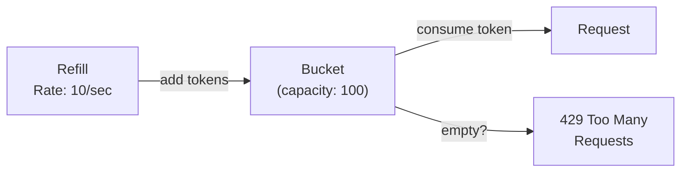
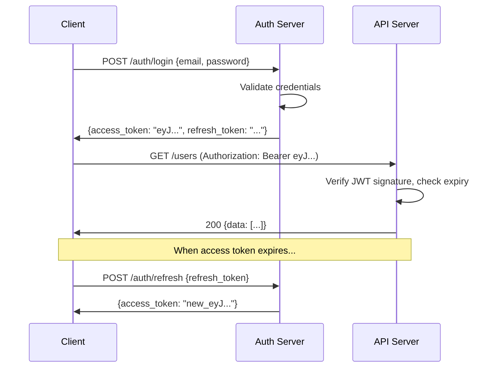
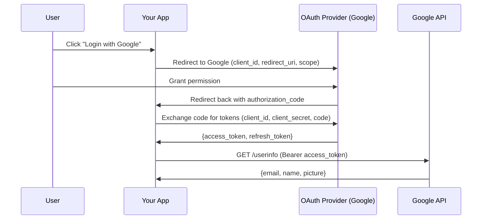

# API Design Patterns for Low-Level Design

> API design is where your LLD meets the outside world. In interviews, designing clean APIs
> demonstrates you can think about contracts, not just internal implementation.

---

## Table of Contents

1. [REST API Design Principles](#1-rest-api-design-principles)
2. [API Versioning Strategies](#2-api-versioning-strategies)
3. [Pagination Patterns](#3-pagination-patterns)
4. [Error Handling Patterns](#4-error-handling-patterns)
5. [Rate Limiting Patterns](#5-rate-limiting-patterns)
6. [Authentication / Authorization Patterns](#6-authentication--authorization-patterns)
7. [API Design Anti-Patterns](#7-api-design-anti-patterns)
8. [Designing APIs for LLD Problems](#8-designing-apis-for-lld-problems)
9. [Interview Questions](#9-interview-questions)

---

## 1. REST API Design Principles

### Resource Naming Conventions

REST APIs are organized around **resources** (nouns), not actions (verbs).

| Rule | Good | Bad |
|------|------|-----|
| Use plural nouns | `/users` | `/user`, `/getUsers` |
| Use path hierarchy for relations | `/users/{id}/orders` | `/getUserOrders?userId=1` |
| Use lowercase with hyphens | `/order-items` | `/orderItems`, `/order_items` |
| No verbs in URLs | `POST /orders` | `POST /createOrder` |
| No file extensions | `/users/123` | `/users/123.json` |

**Resource hierarchy examples:**

```
GET    /users                    # List all users
POST   /users                    # Create a user
GET    /users/{id}               # Get a specific user
PUT    /users/{id}               # Replace a user
PATCH  /users/{id}               # Partially update a user
DELETE /users/{id}               # Delete a user

GET    /users/{id}/orders        # List orders for a user
POST   /users/{id}/orders        # Create an order for a user
GET    /users/{id}/orders/{oid}  # Get a specific order for a user
```

### HTTP Methods Mapping

| Method | Purpose | Idempotent? | Request Body? | Response |
|--------|---------|-------------|---------------|----------|
| **GET** | Read resource(s) | Yes | No | 200 + data |
| **POST** | Create resource | No | Yes | 201 + created resource |
| **PUT** | Replace entire resource | Yes | Yes | 200 + updated resource |
| **PATCH** | Partial update | No* | Yes | 200 + updated resource |
| **DELETE** | Remove resource | Yes | No | 204 (no content) |

*PATCH can be made idempotent depending on implementation.

### HTTP Status Codes

#### Success (2xx)

| Code | Meaning | When to Use |
|------|---------|-------------|
| **200** OK | Successful GET, PUT, PATCH | Default success response |
| **201** Created | Successful POST | Resource was created |
| **204** No Content | Successful DELETE | Nothing to return |

#### Client Errors (4xx)

| Code | Meaning | When to Use |
|------|---------|-------------|
| **400** Bad Request | Malformed request | Invalid JSON, missing required fields |
| **401** Unauthorized | Not authenticated | No token, expired token |
| **403** Forbidden | Authenticated but not authorized | User lacks permission |
| **404** Not Found | Resource does not exist | Invalid ID |
| **409** Conflict | State conflict | Duplicate email, concurrent edit |
| **422** Unprocessable Entity | Validation failed | Business rule violation |
| **429** Too Many Requests | Rate limit exceeded | Throttling |

#### Server Errors (5xx)

| Code | Meaning | When to Use |
|------|---------|-------------|
| **500** Internal Server Error | Unexpected failure | Unhandled exception |
| **502** Bad Gateway | Upstream failure | Third-party API down |
| **503** Service Unavailable | Temporarily down | Maintenance, overloaded |

### Request/Response Format Conventions

**Request (POST /users):**
```json
{
    "name": "Alice Johnson",
    "email": "alice@example.com",
    "role": "user"
}
```

**Success Response (201 Created):**
```json
{
    "data": {
        "id": "usr_abc123",
        "name": "Alice Johnson",
        "email": "alice@example.com",
        "role": "user",
        "created_at": "2024-01-15T10:30:00Z"
    }
}
```

**List Response (200 OK):**
```json
{
    "data": [
        {"id": "usr_abc123", "name": "Alice Johnson"},
        {"id": "usr_def456", "name": "Bob Smith"}
    ],
    "pagination": {
        "total": 150,
        "page": 1,
        "per_page": 20,
        "total_pages": 8
    }
}
```

---

## 2. API Versioning Strategies

### URL Path Versioning (Most Common)

```
GET /v1/users
GET /v2/users
```

```python
# FastAPI example
from fastapi import FastAPI, APIRouter

app = FastAPI()

v1_router = APIRouter(prefix="/v1")
v2_router = APIRouter(prefix="/v2")

@v1_router.get("/users")
def get_users_v1():
    return {"users": [...]}  # Original format

@v2_router.get("/users")
def get_users_v2():
    return {"data": [...], "meta": {...}}  # New format

app.include_router(v1_router)
app.include_router(v2_router)
```

### Header Versioning

```
GET /users
Accept: application/vnd.myapi.v2+json
```

### Query Parameter Versioning

```
GET /users?version=2
```

### Comparison

| Strategy | Pros | Cons |
|----------|------|------|
| **URL Path** | Simple, visible, cache-friendly | URL changes between versions |
| **Header** | Clean URLs, follows REST principles | Hidden, harder to test in browser |
| **Query Param** | Easy to implement | Easy to forget, less standard |

**Recommendation:** URL path versioning is the most widely used and easiest to understand.

---

## 3. Pagination Patterns

### 3.1 Offset-Based Pagination

```
GET /users?page=2&per_page=20
GET /users?offset=20&limit=20
```

```python
# Python implementation
def get_users_paginated(page: int = 1, per_page: int = 20):
    offset = (page - 1) * per_page
    users = db.query("SELECT * FROM users LIMIT ? OFFSET ?",
                     per_page, offset)
    total = db.query("SELECT COUNT(*) FROM users")[0]

    return {
        "data": users,
        "pagination": {
            "page": page,
            "per_page": per_page,
            "total": total,
            "total_pages": (total + per_page - 1) // per_page
        }
    }
```

### 3.2 Cursor-Based Pagination

```
GET /users?limit=20
GET /users?limit=20&cursor=eyJpZCI6IDIwfQ==
```

```python
import base64
import json

def get_users_cursor(limit: int = 20, cursor: str = None):
    if cursor:
        decoded = json.loads(base64.b64decode(cursor))
        last_id = decoded["id"]
        users = db.query(
            "SELECT * FROM users WHERE id > ? ORDER BY id LIMIT ?",
            last_id, limit
        )
    else:
        users = db.query(
            "SELECT * FROM users ORDER BY id LIMIT ?", limit
        )

    next_cursor = None
    if len(users) == limit:
        next_cursor = base64.b64encode(
            json.dumps({"id": users[-1]["id"]}).encode()
        ).decode()

    return {
        "data": users,
        "pagination": {
            "next_cursor": next_cursor,
            "has_more": len(users) == limit
        }
    }
```

### Comparison

| Aspect | Offset-Based | Cursor-Based |
|--------|-------------|--------------|
| **Simplicity** | Simple to implement | More complex |
| **Jump to page** | Yes (go to page 5) | No (sequential only) |
| **Performance** | Slow on large offsets (OFFSET 100000) | Consistent performance |
| **Real-time data** | Misses/duplicates items if data changes | Stable — no missed items |
| **Use case** | Admin panels, search results | Social feeds, real-time data |
| **Example** | Google search results | Twitter timeline, Slack messages |

---

## 4. Error Handling Patterns

### Consistent Error Response Structure

```json
{
    "error": {
        "code": "VALIDATION_ERROR",
        "message": "The request contains invalid fields",
        "details": [
            {
                "field": "email",
                "message": "Must be a valid email address",
                "code": "INVALID_FORMAT"
            },
            {
                "field": "age",
                "message": "Must be at least 18",
                "code": "MIN_VALUE"
            }
        ]
    },
    "request_id": "req_abc123"
}
```

### Python Implementation

```python
from dataclasses import dataclass, field, asdict
from typing import Optional

@dataclass
class FieldError:
    field: str
    message: str
    code: str

@dataclass
class APIError:
    code: str
    message: str
    status: int
    details: list[FieldError] = field(default_factory=list)

    def to_response(self):
        body = {
            "error": {
                "code": self.code,
                "message": self.message,
            }
        }
        if self.details:
            body["error"]["details"] = [asdict(d) for d in self.details]
        return body, self.status

# Predefined error types
class Errors:
    @staticmethod
    def not_found(resource: str, resource_id: str) -> APIError:
        return APIError(
            code="NOT_FOUND",
            message=f"{resource} with id '{resource_id}' not found",
            status=404
        )

    @staticmethod
    def validation_error(field_errors: list[FieldError]) -> APIError:
        return APIError(
            code="VALIDATION_ERROR",
            message="The request contains invalid fields",
            status=422,
            details=field_errors
        )

    @staticmethod
    def unauthorized() -> APIError:
        return APIError(
            code="UNAUTHORIZED",
            message="Authentication required",
            status=401
        )

    @staticmethod
    def forbidden() -> APIError:
        return APIError(
            code="FORBIDDEN",
            message="You do not have permission to perform this action",
            status=403
        )

    @staticmethod
    def conflict(message: str) -> APIError:
        return APIError(
            code="CONFLICT",
            message=message,
            status=409
        )

# Usage in a controller
def create_user(request):
    errors = []
    if not request.get("email"):
        errors.append(FieldError("email", "Email is required", "REQUIRED"))
    if not request.get("name"):
        errors.append(FieldError("name", "Name is required", "REQUIRED"))

    if errors:
        return Errors.validation_error(errors).to_response()

    # ... create user
```

---

## 5. Rate Limiting Patterns

### 5.1 Fixed Window Counter

Divides time into fixed windows (e.g., 1-minute intervals). Counts requests per window.

```mermaid
gantt
    title Fixed Window (100 req/min)
    dateFormat X
    axisFormat %s

    section Window 1
    78 requests    :done, 0, 60
    section Window 2
    100 requests (LIMIT) :crit, 60, 120
    section Window 3
    45 requests    :done, 120, 180
```



```python
import time

class FixedWindowRateLimiter:
    def __init__(self, max_requests: int, window_seconds: int):
        self._max = max_requests
        self._window = window_seconds
        self._counts: dict[str, dict] = {}  # user_id -> {window, count}

    def allow_request(self, user_id: str) -> bool:
        now = time.time()
        current_window = int(now // self._window)

        if user_id not in self._counts:
            self._counts[user_id] = {"window": current_window, "count": 0}

        entry = self._counts[user_id]
        if entry["window"] != current_window:
            entry["window"] = current_window
            entry["count"] = 0

        if entry["count"] >= self._max:
            return False

        entry["count"] += 1
        return True
```

**Problem:** Burst at window boundary. If 100 req/min limit, a user can send 100 requests at 0:59 and 100 at 1:00 = 200 in 2 seconds.

### 5.2 Sliding Window Log

Stores timestamps of all requests. Counts requests within the sliding window.

```python
from collections import defaultdict

class SlidingWindowLogLimiter:
    def __init__(self, max_requests: int, window_seconds: int):
        self._max = max_requests
        self._window = window_seconds
        self._logs: dict[str, list[float]] = defaultdict(list)

    def allow_request(self, user_id: str) -> bool:
        now = time.time()
        window_start = now - self._window

        # Remove expired timestamps
        self._logs[user_id] = [
            ts for ts in self._logs[user_id] if ts > window_start
        ]

        if len(self._logs[user_id]) >= self._max:
            return False

        self._logs[user_id].append(now)
        return True
```

### 5.3 Token Bucket

A bucket holds tokens. Each request consumes a token. Tokens are added at a fixed rate.



```python
class TokenBucketLimiter:
    def __init__(self, capacity: int, refill_rate: float):
        self._capacity = capacity
        self._refill_rate = refill_rate  # tokens per second
        self._buckets: dict[str, dict] = {}

    def allow_request(self, user_id: str) -> bool:
        now = time.time()

        if user_id not in self._buckets:
            self._buckets[user_id] = {
                "tokens": self._capacity,
                "last_refill": now
            }

        bucket = self._buckets[user_id]

        # Refill tokens based on elapsed time
        elapsed = now - bucket["last_refill"]
        new_tokens = elapsed * self._refill_rate
        bucket["tokens"] = min(self._capacity, bucket["tokens"] + new_tokens)
        bucket["last_refill"] = now

        if bucket["tokens"] >= 1:
            bucket["tokens"] -= 1
            return True
        return False
```

### 5.4 Sliding Window Counter

Combines fixed window with weighted counting from the previous window.

```python
class SlidingWindowCounterLimiter:
    def __init__(self, max_requests: int, window_seconds: int):
        self._max = max_requests
        self._window = window_seconds
        self._counters: dict[str, dict] = {}

    def allow_request(self, user_id: str) -> bool:
        now = time.time()
        current_window = int(now // self._window)
        position_in_window = (now % self._window) / self._window

        if user_id not in self._counters:
            self._counters[user_id] = {}

        counters = self._counters[user_id]
        prev_count = counters.get(current_window - 1, 0)
        curr_count = counters.get(current_window, 0)

        # Weighted estimate
        estimated = prev_count * (1 - position_in_window) + curr_count

        if estimated >= self._max:
            return False

        counters[current_window] = curr_count + 1
        return True
```

### Rate Limiting Comparison

| Algorithm | Memory | Accuracy | Burst Handling | Complexity |
|-----------|--------|----------|---------------|------------|
| **Fixed Window** | Low | Low (boundary burst) | Poor | Simple |
| **Sliding Window Log** | High (stores timestamps) | High | Good | Medium |
| **Token Bucket** | Low | Good | Allows controlled bursts | Medium |
| **Sliding Window Counter** | Low | Good | Good | Medium |

**Most common in practice:** Token Bucket (AWS, Stripe) and Sliding Window Counter (Redis-based).

---

## 6. Authentication / Authorization Patterns

### 6.1 API Key

```
GET /users
X-API-Key: sk_live_abc123def456
```

Simple but limited — no user context, hard to revoke per-user.

### 6.2 JWT (JSON Web Token)



**JWT Structure:**
```
Header.Payload.Signature

Header:  {"alg": "HS256", "typ": "JWT"}
Payload: {"user_id": "123", "role": "admin", "exp": 1700000000}
Signature: HMACSHA256(base64(header) + "." + base64(payload), secret)
```

```python
import jwt
from datetime import datetime, timedelta

SECRET_KEY = "your-secret-key"

def create_token(user_id: str, role: str) -> str:
    payload = {
        "user_id": user_id,
        "role": role,
        "exp": datetime.utcnow() + timedelta(hours=1),
        "iat": datetime.utcnow()
    }
    return jwt.encode(payload, SECRET_KEY, algorithm="HS256")

def verify_token(token: str) -> dict:
    try:
        return jwt.decode(token, SECRET_KEY, algorithms=["HS256"])
    except jwt.ExpiredSignatureError:
        raise AuthError("Token expired")
    except jwt.InvalidTokenError:
        raise AuthError("Invalid token")

# Middleware
def auth_middleware(request):
    auth_header = request.headers.get("Authorization")
    if not auth_header or not auth_header.startswith("Bearer "):
        return Errors.unauthorized().to_response()

    token = auth_header.split(" ")[1]
    try:
        payload = verify_token(token)
        request.user = payload
    except AuthError:
        return Errors.unauthorized().to_response()
```

### 6.3 OAuth2 Flow Overview



### Comparison

| Method | Use Case | Pros | Cons |
|--------|----------|------|------|
| **API Key** | Server-to-server, simple APIs | Simple | No user context, hard to scope |
| **JWT** | User authentication, microservices | Stateless, self-contained | Token size, cannot revoke mid-expiry |
| **OAuth2** | Third-party login, delegated access | Industry standard, scoped | Complex flow |

---

## 7. API Design Anti-Patterns

### 7.1 Chatty APIs

**Bad:** Multiple calls to get one screen of data.
```
GET /users/123
GET /users/123/address
GET /users/123/preferences
GET /users/123/orders?limit=5
```

**Better:** One call with includes or a composite endpoint.
```
GET /users/123?include=address,preferences,recent_orders
```

### 7.2 God Endpoints

**Bad:** One endpoint does everything.
```
POST /api
{
    "action": "get_user",
    "user_id": 123
}

POST /api
{
    "action": "create_order",
    "items": [...]
}
```

**Better:** Separate resource endpoints with HTTP methods.
```
GET  /users/123
POST /orders
```

### 7.3 Inconsistent Naming

**Bad:**
```
GET /users          # plural
GET /getOrder/123   # verb + singular
POST /create-item   # verb in URL
GET /UserProfile    # PascalCase
```

**Better:** Consistent plural nouns, lowercase, hyphens:
```
GET  /users
GET  /orders/123
POST /items
GET  /user-profiles
```

### 7.4 Exposing Internal IDs

**Bad:**
```json
{
    "id": 42,
    "database_row_id": 12345,
    "internal_code": "SYS_USR_0042"
}
```

**Better:** Use opaque external IDs:
```json
{
    "id": "usr_abc123"
}
```

### 7.5 Not Using Proper Status Codes

**Bad:**
```json
HTTP 200 OK
{
    "success": false,
    "error": "User not found"
}
```

**Better:**
```json
HTTP 404 Not Found
{
    "error": {
        "code": "NOT_FOUND",
        "message": "User not found"
    }
}
```

### 7.6 Leaking Implementation Details

**Bad:**
```json
{
    "error": "NullPointerException at UserService.java:42",
    "stack_trace": "..."
}
```

**Better:**
```json
{
    "error": {
        "code": "INTERNAL_ERROR",
        "message": "An unexpected error occurred. Please try again."
    }
}
```

---

## 8. Designing APIs for LLD Problems

### Example 1: Parking Lot System API

```
# Parking Lot Management
POST   /parking-lots                           # Create a parking lot
GET    /parking-lots/{lot_id}                  # Get lot details + availability
GET    /parking-lots/{lot_id}/floors           # List floors
GET    /parking-lots/{lot_id}/spots            # List spots with filters

# Parking Operations
POST   /parking-lots/{lot_id}/entries          # Vehicle enters (creates ticket)
    Request:  {"vehicle_number": "ABC-123", "vehicle_type": "car"}
    Response: {"ticket_id": "TKT-001", "spot": "F2-A15", "entry_time": "..."}

POST   /parking-lots/{lot_id}/exits            # Vehicle exits (closes ticket)
    Request:  {"ticket_id": "TKT-001"}
    Response: {"fee": 150.00, "duration_minutes": 120, "payment_status": "pending"}

# Payment
POST   /tickets/{ticket_id}/payments           # Pay for ticket
    Request:  {"method": "card", "card_token": "tok_abc"}
    Response: {"payment_id": "PAY-001", "amount": 150.00, "status": "success"}

# Admin
GET    /parking-lots/{lot_id}/reports/occupancy  # Occupancy report
GET    /parking-lots/{lot_id}/reports/revenue    # Revenue report
```

### Example 2: BookMyShow System API

```
# Movies
GET    /movies                                # List movies (with filters)
GET    /movies/{movie_id}                     # Movie details
GET    /movies/{movie_id}/shows               # Shows for a movie

# Theaters
GET    /cities/{city_id}/theaters             # Theaters in a city
GET    /theaters/{theater_id}/screens         # Screens in a theater
GET    /theaters/{theater_id}/shows           # All shows at a theater

# Shows
GET    /shows/{show_id}                       # Show details
GET    /shows/{show_id}/seats                 # Available seats
    Response: {
        "seats": [
            {"id": "A1", "row": "A", "number": 1, "type": "premium",
             "price": 300, "status": "available"},
            {"id": "A2", "row": "A", "number": 2, "type": "premium",
             "price": 300, "status": "booked"}
        ]
    }

# Bookings
POST   /bookings                              # Create booking (hold seats)
    Request:  {
        "show_id": "show_123",
        "seat_ids": ["A1", "A2"],
        "user_id": "usr_456"
    }
    Response: {
        "booking_id": "BKG-001",
        "status": "pending_payment",
        "total": 600.00,
        "hold_expires_at": "2024-01-15T10:40:00Z"
    }

GET    /bookings/{booking_id}                 # Booking details
DELETE /bookings/{booking_id}                 # Cancel booking

# Payment
POST   /bookings/{booking_id}/payments        # Pay for booking
    Request:  {"method": "upi", "upi_id": "user@bank"}
    Response: {"status": "confirmed", "ticket_url": "/tickets/TKT-001"}

# User
GET    /users/{user_id}/bookings              # User's bookings
```

### API Design Checklist for LLD Interviews

When asked to design APIs for an LLD problem:

1. **Identify the resources** (nouns): users, orders, tickets, spots
2. **Define the relationships**: user has many orders, show has many seats
3. **Map CRUD operations** to HTTP methods
4. **Design the URL hierarchy** using resource nesting
5. **Specify request/response formats** for key endpoints
6. **Add pagination** for list endpoints
7. **Define error responses** for common failures
8. **Consider authentication** requirements
9. **Note any real-time needs** (WebSocket for seat availability)

---

## 9. Interview Questions

### REST Design

1. **Design the REST API for a Library Management System.**
   - Resources: books, members, loans. `POST /loans {book_id, member_id}` to borrow. `PATCH /loans/{id} {returned: true}` to return. `GET /books?available=true` for available books.

2. **What is the difference between PUT and PATCH?**
   - PUT replaces the entire resource. PATCH updates specific fields. PUT is idempotent. PATCH may or may not be.

3. **When would you use 401 vs 403?**
   - 401: not authenticated (no token, bad token). 403: authenticated but lacks permission.

4. **How do you handle bulk operations in REST?**
   - `POST /users/bulk` with array body, or `PATCH /orders` with array of updates. Return per-item status in response.

### Pagination

5. **When would you choose cursor-based over offset-based pagination?**
   - Cursor for real-time data (social feeds, chat), large datasets. Offset for admin dashboards, search results where jumping to pages is needed.

6. **What happens with offset pagination when data changes between requests?**
   - Items can be skipped or duplicated. If item 15 is deleted between page 1 (1-20) and page 2 (21-40), item 21 becomes item 20 and is missed.

### Rate Limiting

7. **Explain the Token Bucket algorithm.**
   - Bucket has capacity N. Tokens added at rate R/second. Each request takes one token. If empty, request rejected. Allows bursts up to N, sustains R requests/second.

8. **How would you implement rate limiting for a distributed system?**
   - Use Redis as shared counter. INCR key with TTL for fixed window. Lua scripts for atomic operations. Or use a distributed token bucket with Redis.

### Authentication

9. **Why use JWTs instead of session cookies?**
   - Stateless (no server-side session store). Works across services (microservices). Can carry user data (role, permissions). Better for mobile clients.

10. **What are the security concerns with JWTs?**
    - Cannot be revoked before expiry (use short-lived tokens + refresh). Token size can be large. Must be stored securely on client. Signature algorithm must be validated.

### API Design in LLD

11. **You just designed a Parking Lot in an LLD interview. Now design its API.**
    - See the Parking Lot API example above.

12. **How do you handle long-running operations in REST?**
    - Return `202 Accepted` with a status URL. Client polls: `GET /operations/{id}` returns `{status: "processing"}` or `{status: "completed", result: {...}}`.

13. **Design an API that handles seat booking with concurrent users.**
    - Use optimistic locking: `POST /bookings` with seat IDs. If seats taken between check and book, return `409 Conflict`. Use temporary holds: seats locked for 5 minutes during payment.

14. **What headers should a well-designed API return?**
    - `Content-Type`, `X-Request-Id` (tracing), `X-RateLimit-Remaining`, `X-RateLimit-Reset`, `Cache-Control`, `ETag`.

15. **How would you design an API for a chat application?**
    - REST for CRUD (create room, list messages). WebSocket for real-time message delivery. `GET /rooms/{id}/messages?cursor=xyz` for history. `WS /rooms/{id}/stream` for live messages.

---

## Quick Reference

| Topic | Key Point |
|-------|-----------|
| **Resources** | Plural nouns, hierarchical: `/users/{id}/orders` |
| **Methods** | GET=read, POST=create, PUT=replace, PATCH=update, DELETE=remove |
| **Status codes** | 200/201/204 success, 400/401/403/404/409/422 client, 500 server |
| **Versioning** | URL path (`/v1/`) is most common and practical |
| **Pagination** | Offset for jumpable, cursor for real-time/large datasets |
| **Errors** | Consistent structure: `{error: {code, message, details}}` |
| **Rate limiting** | Token Bucket (burst-friendly) or Sliding Window (accurate) |
| **Auth** | JWT for stateless user auth, API Key for server-to-server |
| **Anti-patterns** | Chatty APIs, God endpoints, inconsistent naming, leaking internals |
