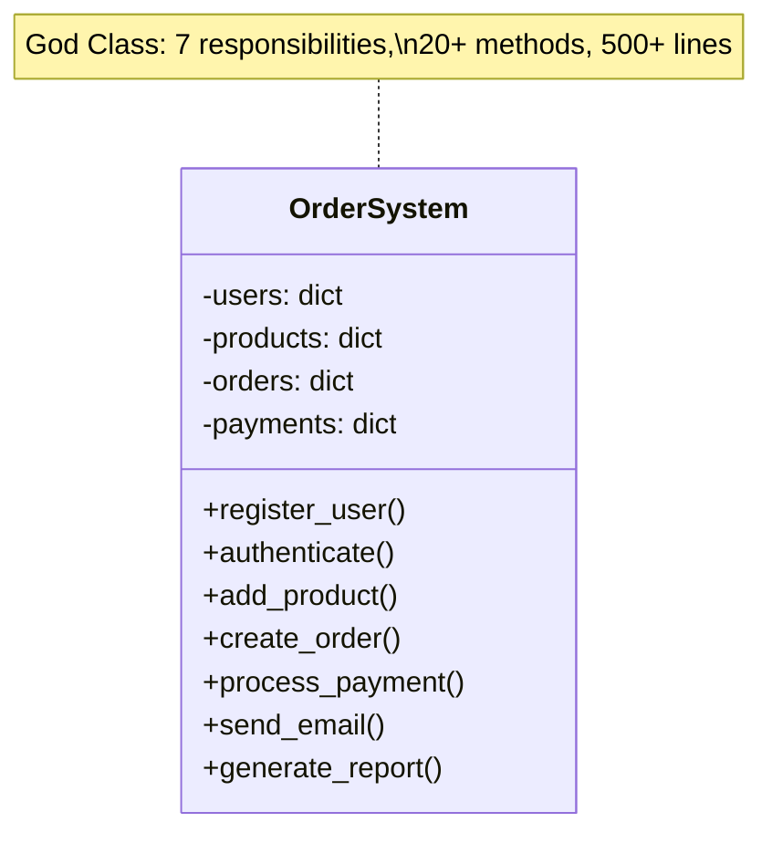
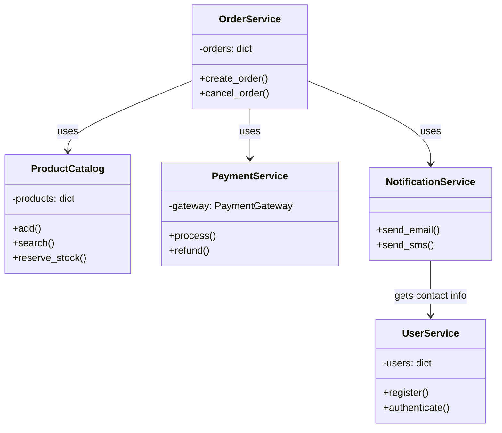
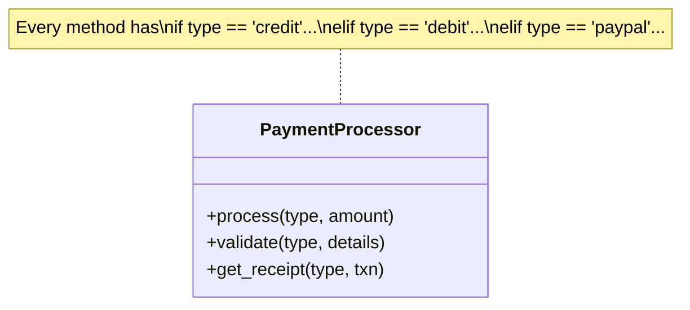
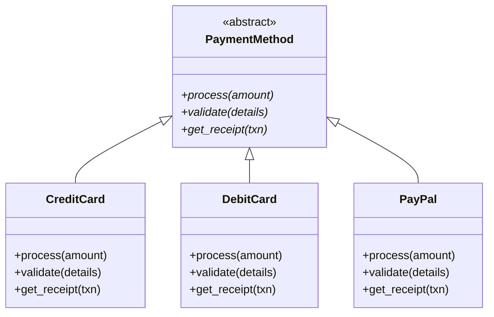

# Refactoring Techniques & Code Smells

> A comprehensive guide to identifying bad code, understanding why it's bad, and systematically improving it using proven refactoring techniques.

---

## Table of Contents

- [Part A: Code Smells](#part-a-code-smells)
- [Part B: Refactoring Techniques](#part-b-refactoring-techniques)
- [Part C: Refactoring in LLD Interviews](#part-c-refactoring-in-lld-interviews)

---

# Part A: Code Smells

Code smells are surface indicators of deeper problems in your codebase. They don't break functionality but signal design weaknesses that slow development and breed bugs.

---

## 1. God Class

**What it is:** A class that has grown to handle too many responsibilities -- often 1000+ lines, dozens of methods, and knowledge about unrelated domains.

**Detection signals:**
- Class has 15+ methods spanning multiple domains
- You can't describe the class purpose in one sentence
- Changes to unrelated features keep touching this class
- The class imports from many unrelated modules

### BAD Code

```python
class ECommerceApp:
    """This class does EVERYTHING -- classic God Class."""

    def __init__(self):
        self.users = {}
        self.products = {}
        self.orders = {}
        self.payments = {}
        self.email_config = {"smtp": "mail.example.com", "port": 587}

    # --- User Management ---
    def register_user(self, username, email, password):
        self.users[username] = {"email": email, "password": password}

    def authenticate_user(self, username, password):
        user = self.users.get(username)
        return user and user["password"] == password

    def reset_password(self, username, new_password):
        if username in self.users:
            self.users[username]["password"] = new_password

    # --- Product Catalog ---
    def add_product(self, product_id, name, price, stock):
        self.products[product_id] = {"name": name, "price": price, "stock": stock}

    def update_stock(self, product_id, quantity):
        if product_id in self.products:
            self.products[product_id]["stock"] += quantity

    def search_products(self, keyword):
        return {pid: p for pid, p in self.products.items() if keyword in p["name"]}

    # --- Order Processing ---
    def create_order(self, username, product_id, quantity):
        product = self.products.get(product_id)
        if not product or product["stock"] < quantity:
            return None
        order_id = f"ORD-{len(self.orders) + 1}"
        total = product["price"] * quantity
        self.orders[order_id] = {
            "user": username, "product": product_id,
            "quantity": quantity, "total": total, "status": "pending"
        }
        product["stock"] -= quantity
        return order_id

    # --- Payment Processing ---
    def process_payment(self, order_id, card_number, cvv):
        order = self.orders.get(order_id)
        if not order:
            return False
        # Simulate payment gateway call
        self.payments[order_id] = {"card": card_number[-4:], "amount": order["total"]}
        order["status"] = "paid"
        return True

    # --- Email Notifications ---
    def send_order_confirmation(self, order_id):
        order = self.orders.get(order_id)
        user = self.users.get(order["user"])
        print(f"Sending email to {user['email']}: Order {order_id} confirmed!")

    def send_shipping_notification(self, order_id):
        order = self.orders.get(order_id)
        user = self.users.get(order["user"])
        print(f"Sending email to {user['email']}: Order {order_id} shipped!")
```

**Why it's bad:** This class has 5 distinct responsibilities (users, products, orders, payments, emails). Any change to payment logic risks breaking order processing. Testing one responsibility requires instantiating the entire monolith.

### GOOD Refactored Code

```python
class UserService:
    def __init__(self):
        self.users = {}

    def register(self, username, email, password):
        self.users[username] = {"email": email, "password": password}

    def authenticate(self, username, password):
        user = self.users.get(username)
        return user and user["password"] == password

    def get_email(self, username):
        return self.users[username]["email"]


class ProductCatalog:
    def __init__(self):
        self.products = {}

    def add(self, product_id, name, price, stock):
        self.products[product_id] = {"name": name, "price": price, "stock": stock}

    def reserve_stock(self, product_id, quantity):
        product = self.products[product_id]
        if product["stock"] < quantity:
            raise ValueError("Insufficient stock")
        product["stock"] -= quantity

    def get_price(self, product_id):
        return self.products[product_id]["price"]


class OrderService:
    def __init__(self, catalog: ProductCatalog):
        self.catalog = catalog
        self.orders = {}

    def create_order(self, username, product_id, quantity):
        self.catalog.reserve_stock(product_id, quantity)
        total = self.catalog.get_price(product_id) * quantity
        order_id = f"ORD-{len(self.orders) + 1}"
        self.orders[order_id] = {
            "user": username, "product": product_id,
            "quantity": quantity, "total": total, "status": "pending"
        }
        return order_id


class PaymentService:
    def __init__(self, order_service: OrderService):
        self.order_service = order_service
        self.payments = {}

    def process(self, order_id, card_number):
        order = self.order_service.orders[order_id]
        self.payments[order_id] = {"card": card_number[-4:], "amount": order["total"]}
        order["status"] = "paid"


class NotificationService:
    def __init__(self, user_service: UserService):
        self.user_service = user_service

    def send_order_confirmation(self, order_id, username):
        email = self.user_service.get_email(username)
        print(f"Sending email to {email}: Order {order_id} confirmed!")
```

**Fix applied:** Extract Class -- split into 5 focused classes each with a single responsibility.

---

## 2. Feature Envy

**What it is:** A method that uses another class's data more than its own. It "envies" the features (data) of another class and probably belongs there instead.

**Detection signals:**
- Method calls 3+ getters on another object
- Method does little with `self` but a lot with a passed-in object
- The method's logic would be simpler if it lived in the other class

### BAD Code

```python
class Address:
    def __init__(self, street, city, state, zip_code, country):
        self.street = street
        self.city = city
        self.state = state
        self.zip_code = zip_code
        self.country = country


class OrderPrinter:
    def format_shipping_label(self, address: Address):
        # This method uses ONLY Address data -- it envies Address
        label = f"{address.street}\n"
        label += f"{address.city}, {address.state} {address.zip_code}\n"
        label += f"{address.country}"
        if address.country != "US":
            label = f"INTERNATIONAL\n{label}"
        return label

    def calculate_shipping(self, address: Address, weight: float):
        # Again, mostly working with Address data
        if address.country != "US":
            return weight * 15.0
        elif address.state in ("AK", "HI"):
            return weight * 10.0
        else:
            return weight * 5.0
```

**Why it's bad:** `OrderPrinter` knows too much about `Address` internals. If `Address` changes its structure, `OrderPrinter` breaks. The logic naturally belongs to `Address`.

### GOOD Refactored Code

```python
class Address:
    def __init__(self, street, city, state, zip_code, country):
        self.street = street
        self.city = city
        self.state = state
        self.zip_code = zip_code
        self.country = country

    def format_label(self):
        label = f"{self.street}\n{self.city}, {self.state} {self.zip_code}\n{self.country}"
        if self.country != "US":
            label = f"INTERNATIONAL\n{label}"
        return label

    def calculate_shipping(self, weight: float):
        if self.country != "US":
            return weight * 15.0
        elif self.state in ("AK", "HI"):
            return weight * 10.0
        else:
            return weight * 5.0


class OrderPrinter:
    def format_shipping_label(self, address: Address):
        return address.format_label()  # Delegate to where data lives
```

**Fix applied:** Move Method -- moved logic to the class that owns the data.

---

## 3. Shotgun Surgery

**What it is:** A single logical change requires editing many classes scattered across the codebase. The opposite of the God Class -- responsibility is too spread out.

**Detection signals:**
- Adding a new feature touches 10+ files
- A simple change like "add user phone number" requires modifying User, UserDTO, UserValidator, UserSerializer, UserRepository, UserController, UserForm, etc.
- You keep forgetting to update one of the many places

### BAD Code

```python
# Adding "phone number" to user requires changes in ALL these classes:

class User:
    def __init__(self, name, email):  # Need to add phone here
        self.name = name
        self.email = email

class UserValidator:
    def validate(self, name, email):  # And here
        if not name: raise ValueError("Name required")
        if "@" not in email: raise ValueError("Invalid email")

class UserSerializer:
    def to_dict(self, user):  # And here
        return {"name": user.name, "email": user.email}

    def from_dict(self, data):  # And here
        return User(data["name"], data["email"])

class UserRepository:
    def save(self, user):  # And here (SQL columns)
        query = f"INSERT INTO users (name, email) VALUES ('{user.name}', '{user.email}')"

class UserDisplay:
    def render(self, user):  # And here
        return f"Name: {user.name} | Email: {user.email}"
```

**Why it's bad:** Adding a single field requires modifying 6 classes. Miss one and you have a bug. This is fragile and error-prone.

### GOOD Refactored Code

```python
class User:
    """User is the single source of truth for its own structure."""
    FIELDS = ["name", "email", "phone"]  # Add field ONCE here

    def __init__(self, **kwargs):
        for field in self.FIELDS:
            setattr(self, field, kwargs.get(field))

    def validate(self):
        if not self.name: raise ValueError("Name required")
        if "@" not in self.email: raise ValueError("Invalid email")

    def to_dict(self):
        return {field: getattr(self, field) for field in self.FIELDS}

    @classmethod
    def from_dict(cls, data):
        return cls(**{f: data.get(f) for f in cls.FIELDS})

    def display(self):
        return " | ".join(f"{f}: {getattr(self, f)}" for f in self.FIELDS)
```

**Fix applied:** Move Method + Inline Class -- consolidated scattered logic into the class that owns the data. Now adding a field means changing ONE place.

---

## 4. Primitive Obsession

**What it is:** Using primitive types (str, int, float) to represent domain concepts that deserve their own class. Strings for email addresses, integers for money, tuples for coordinates.

**Detection signals:**
- Validation logic for a string scattered across many places
- Comments explaining what a string/int represents
- Same formatting logic applied to the same primitive in multiple methods

### BAD Code

```python
class User:
    def __init__(self, name: str, email: str, phone: str, age: int):
        self.name = name
        self.email = email      # Just a string -- no validation
        self.phone = phone      # Just a string -- formatting varies
        self.age = age          # Negative age? No protection

    def send_email(self):
        # Validation scattered everywhere email is used
        if "@" not in self.email or "." not in self.email:
            raise ValueError("Invalid email")
        print(f"Sending to {self.email}")

class OrderService:
    def create_order(self, amount: float, currency: str):
        # Money as float -- floating point errors!
        tax = amount * 0.08
        total = amount + tax  # 19.99 + 1.5992 = 21.589199999...
        print(f"Total: {currency} {total:.2f}")

    def apply_discount(self, amount: float, discount: float):
        return amount - (amount * discount)  # Is discount 0.1 or 10?
```

**Why it's bad:** No type safety, validation is scattered, floating-point arithmetic bugs with money, and the code doesn't communicate intent.

### GOOD Refactored Code

```python
import re
from dataclasses import dataclass


@dataclass(frozen=True)
class Email:
    value: str

    def __post_init__(self):
        if not re.match(r"^[\w.-]+@[\w.-]+\.\w+$", self.value):
            raise ValueError(f"Invalid email: {self.value}")

    def __str__(self):
        return self.value

    @property
    def domain(self):
        return self.value.split("@")[1]


@dataclass(frozen=True)
class PhoneNumber:
    value: str

    def __post_init__(self):
        digits = re.sub(r"\D", "", self.value)
        if len(digits) not in (10, 11):
            raise ValueError(f"Invalid phone: {self.value}")

    def formatted(self):
        digits = re.sub(r"\D", "", self.value)
        return f"({digits[:3]}) {digits[3:6]}-{digits[6:]}"


@dataclass(frozen=True)
class Money:
    amount_cents: int  # Store as cents to avoid float issues
    currency: str = "USD"

    @classmethod
    def from_dollars(cls, dollars: float, currency: str = "USD"):
        return cls(round(dollars * 100), currency)

    def __add__(self, other):
        if self.currency != other.currency:
            raise ValueError("Cannot add different currencies")
        return Money(self.amount_cents + other.amount_cents, self.currency)

    def __mul__(self, factor: float):
        return Money(round(self.amount_cents * factor), self.currency)

    def __str__(self):
        return f"{self.currency} {self.amount_cents / 100:.2f}"


class User:
    def __init__(self, name: str, email: Email, phone: PhoneNumber):
        self.name = name
        self.email = email  # Validated at construction
        self.phone = phone  # Formatted consistently

    def send_email(self):
        print(f"Sending to {self.email}")  # Always valid


# Usage
price = Money.from_dollars(19.99)
tax = price * 0.08
total = price + tax  # Exact arithmetic, no float bugs
print(f"Total: {total}")  # USD 21.59
```

**Fix applied:** Replace Primitive with Value Object -- created `Email`, `PhoneNumber`, `Money` classes that encapsulate validation and behavior.

---

## 5. Long Parameter List

**What it is:** Methods with 5+ parameters, making them hard to call, hard to read, and easy to get wrong (especially with positional arguments).

**Detection signals:**
- Method signatures that don't fit on one line
- Callers passing `None` for parameters they don't need
- Easy to swap two parameters of the same type

### BAD Code

```python
def create_user(first_name, last_name, email, phone, street, city,
                state, zip_code, country, role, department, manager_id,
                start_date, salary, is_active=True):
    """13 parameters -- impossible to remember the order."""
    pass

# Caller has no idea what each positional arg means
create_user("John", "Doe", "john@x.com", "555-1234", "123 Main St",
            "NYC", "NY", "10001", "US", "engineer", "engineering",
            "MGR-42", "2024-01-15", 95000)
```

### GOOD Refactored Code

```python
from dataclasses import dataclass, field
from datetime import date


@dataclass
class Address:
    street: str
    city: str
    state: str
    zip_code: str
    country: str = "US"


@dataclass
class EmploymentInfo:
    role: str
    department: str
    manager_id: str
    start_date: date
    salary: int


@dataclass
class CreateUserRequest:
    first_name: str
    last_name: str
    email: str
    phone: str
    address: Address
    employment: EmploymentInfo
    is_active: bool = True


def create_user(request: CreateUserRequest):
    """Single parameter -- clear, self-documenting, extensible."""
    print(f"Creating user: {request.first_name} {request.last_name}")
    print(f"  Address: {request.address.city}, {request.address.state}")
    print(f"  Role: {request.employment.role}")


# Caller is self-documenting
create_user(CreateUserRequest(
    first_name="John",
    last_name="Doe",
    email="john@x.com",
    phone="555-1234",
    address=Address(street="123 Main St", city="NYC", state="NY", zip_code="10001"),
    employment=EmploymentInfo(
        role="engineer", department="engineering",
        manager_id="MGR-42", start_date=date(2024, 1, 15), salary=95000
    ),
))
```

**Fix applied:** Introduce Parameter Object -- grouped related parameters into cohesive data classes.

---

## 6. Data Clumps

**What it is:** The same group of variables appearing together in multiple places -- method parameters, class fields, or local variables that always travel as a pack.

**Detection signals:**
- Same 3+ parameters appear in multiple method signatures
- Fields that are always accessed together
- You can't use one without the others

### BAD Code

```python
class EventSystem:
    def create_event(self, title, start_year, start_month, start_day,
                     start_hour, start_minute, end_year, end_month,
                     end_day, end_hour, end_minute):
        pass

    def is_overlapping(self, start_year1, start_month1, start_day1,
                       start_hour1, start_minute1, end_year1, end_month1,
                       end_day1, end_hour1, end_minute1,
                       start_year2, start_month2, start_day2,
                       start_hour2, start_minute2, end_year2, end_month2,
                       end_day2, end_hour2, end_minute2):
        pass  # 20 parameters!

    def format_event(self, title, start_year, start_month, start_day,
                     start_hour, start_minute):
        return f"{title}: {start_year}-{start_month}-{start_day} {start_hour}:{start_minute}"
```

### GOOD Refactored Code

```python
from dataclasses import dataclass
from datetime import datetime


@dataclass
class TimeSlot:
    start: datetime
    end: datetime

    def overlaps(self, other: "TimeSlot") -> bool:
        return self.start < other.end and other.start < self.end

    def duration_minutes(self) -> int:
        return int((self.end - self.start).total_seconds() / 60)


@dataclass
class Event:
    title: str
    time_slot: TimeSlot

    def overlaps(self, other: "Event") -> bool:
        return self.time_slot.overlaps(other.time_slot)

    def __str__(self):
        return f"{self.title}: {self.time_slot.start:%Y-%m-%d %H:%M}"
```

**Fix applied:** Extract Class -- created `TimeSlot` to encapsulate the data clump, then gave it behavior (overlap checking).

---

## 7. Switch Statements (Long Conditionals)

**What it is:** Long if/elif/else or switch chains that check a type field to decide behavior. This is one of the **most commonly asked about** smells in LLD interviews.

**Detection signals:**
- The same switch/if-else appears in multiple methods
- Adding a new type requires changing many places
- Type checking with `isinstance` or string comparisons

### BAD Code

```python
class Shape:
    def __init__(self, shape_type, **kwargs):
        self.shape_type = shape_type
        self.kwargs = kwargs

def calculate_area(shape):
    if shape.shape_type == "circle":
        return 3.14159 * shape.kwargs["radius"] ** 2
    elif shape.shape_type == "rectangle":
        return shape.kwargs["width"] * shape.kwargs["height"]
    elif shape.shape_type == "triangle":
        return 0.5 * shape.kwargs["base"] * shape.kwargs["height"]
    # Adding a new shape? Must modify this function AND every other
    # function that switches on shape_type
    else:
        raise ValueError(f"Unknown shape: {shape.shape_type}")

def calculate_perimeter(shape):
    if shape.shape_type == "circle":
        return 2 * 3.14159 * shape.kwargs["radius"]
    elif shape.shape_type == "rectangle":
        return 2 * (shape.kwargs["width"] + shape.kwargs["height"])
    elif shape.shape_type == "triangle":
        return shape.kwargs["a"] + shape.kwargs["b"] + shape.kwargs["c"]
    else:
        raise ValueError(f"Unknown shape: {shape.shape_type}")

def draw(shape):
    if shape.shape_type == "circle":
        print(f"Drawing circle with radius {shape.kwargs['radius']}")
    elif shape.shape_type == "rectangle":
        print(f"Drawing {shape.kwargs['width']}x{shape.kwargs['height']} rectangle")
    elif shape.shape_type == "triangle":
        print(f"Drawing triangle with base {shape.kwargs['base']}")
```

**Why it's bad:** Three switch statements on the same type. Adding "pentagon" means editing 3 functions. Violates Open/Closed Principle.

### GOOD Refactored Code

```python
from abc import ABC, abstractmethod
import math


class Shape(ABC):
    @abstractmethod
    def area(self) -> float:
        pass

    @abstractmethod
    def perimeter(self) -> float:
        pass

    @abstractmethod
    def draw(self) -> None:
        pass


class Circle(Shape):
    def __init__(self, radius: float):
        self.radius = radius

    def area(self):
        return math.pi * self.radius ** 2

    def perimeter(self):
        return 2 * math.pi * self.radius

    def draw(self):
        print(f"Drawing circle with radius {self.radius}")


class Rectangle(Shape):
    def __init__(self, width: float, height: float):
        self.width = width
        self.height = height

    def area(self):
        return self.width * self.height

    def perimeter(self):
        return 2 * (self.width + self.height)

    def draw(self):
        print(f"Drawing {self.width}x{self.height} rectangle")


class Triangle(Shape):
    def __init__(self, base: float, height: float, a: float, b: float, c: float):
        self.base = base
        self.height = height
        self.a, self.b, self.c = a, b, c

    def area(self):
        return 0.5 * self.base * self.height

    def perimeter(self):
        return self.a + self.b + self.c

    def draw(self):
        print(f"Drawing triangle with base {self.base}")


# Adding Pentagon? Just add a new class. Zero existing code changes.
class Pentagon(Shape):
    def __init__(self, side: float):
        self.side = side

    def area(self):
        return (math.sqrt(5 * (5 + 2 * math.sqrt(5))) / 4) * self.side ** 2

    def perimeter(self):
        return 5 * self.side

    def draw(self):
        print(f"Drawing pentagon with side {self.side}")
```

**Fix applied:** Replace Conditional with Polymorphism -- each shape type is a class that knows how to compute its own area, perimeter, and drawing.

---

## 8. Duplicate Code

**What it is:** The same or very similar logic appearing in multiple places. When a bug is found, it must be fixed in all copies -- and you always miss one.

**Detection signals:**
- Copy-paste sections with minor variations
- Methods that look "almost the same"
- Bug fixes that require changing multiple files

### BAD Code

```python
class ReportGenerator:
    def generate_sales_report(self, data):
        # Header
        report = "=" * 50 + "\n"
        report += "SALES REPORT\n"
        report += f"Generated: 2024-01-15\n"
        report += "=" * 50 + "\n"
        # Process data
        total = sum(item["amount"] for item in data)
        report += f"Total Sales: ${total:,.2f}\n"
        report += f"Number of transactions: {len(data)}\n"
        # Footer
        report += "-" * 50 + "\n"
        report += "END OF REPORT\n"
        return report

    def generate_inventory_report(self, data):
        # Header -- DUPLICATED
        report = "=" * 50 + "\n"
        report += "INVENTORY REPORT\n"
        report += f"Generated: 2024-01-15\n"
        report += "=" * 50 + "\n"
        # Process data (different logic)
        total_items = sum(item["quantity"] for item in data)
        report += f"Total Items: {total_items}\n"
        report += f"Number of SKUs: {len(data)}\n"
        # Footer -- DUPLICATED
        report += "-" * 50 + "\n"
        report += "END OF REPORT\n"
        return report

    def generate_employee_report(self, data):
        # Header -- DUPLICATED AGAIN
        report = "=" * 50 + "\n"
        report += "EMPLOYEE REPORT\n"
        report += f"Generated: 2024-01-15\n"
        report += "=" * 50 + "\n"
        # Process data
        avg_salary = sum(e["salary"] for e in data) / len(data)
        report += f"Average Salary: ${avg_salary:,.2f}\n"
        report += f"Headcount: {len(data)}\n"
        # Footer -- DUPLICATED AGAIN
        report += "-" * 50 + "\n"
        report += "END OF REPORT\n"
        return report
```

### GOOD Refactored Code

```python
from abc import ABC, abstractmethod
from datetime import date


class ReportGenerator(ABC):
    """Template Method pattern eliminates duplicate header/footer logic."""

    def generate(self, data) -> str:
        report = self._header()
        report += self._body(data)
        report += self._footer()
        return report

    def _header(self) -> str:
        return (
            "=" * 50 + "\n"
            f"{self.title()}\n"
            f"Generated: {date.today()}\n"
            "=" * 50 + "\n"
        )

    def _footer(self) -> str:
        return "-" * 50 + "\n" + "END OF REPORT\n"

    @abstractmethod
    def title(self) -> str:
        pass

    @abstractmethod
    def _body(self, data) -> str:
        pass


class SalesReport(ReportGenerator):
    def title(self):
        return "SALES REPORT"

    def _body(self, data):
        total = sum(item["amount"] for item in data)
        return f"Total Sales: ${total:,.2f}\nTransactions: {len(data)}\n"


class InventoryReport(ReportGenerator):
    def title(self):
        return "INVENTORY REPORT"

    def _body(self, data):
        total_items = sum(item["quantity"] for item in data)
        return f"Total Items: {total_items}\nSKUs: {len(data)}\n"


class EmployeeReport(ReportGenerator):
    def title(self):
        return "EMPLOYEE REPORT"

    def _body(self, data):
        avg = sum(e["salary"] for e in data) / len(data)
        return f"Average Salary: ${avg:,.2f}\nHeadcount: {len(data)}\n"
```

**Fix applied:** Extract Method + Template Method Pattern -- the shared header/footer logic lives in one place. Each report only defines its unique parts.

---

## 9. Lazy Class

**What it is:** A class that barely does anything -- perhaps a thin wrapper that adds no value, or a class created speculatively that never grew into its intended purpose.

**Detection signals:**
- Class has only 1-2 trivial methods
- Class just delegates everything to another class
- Class was created "for future extensibility" that never came

### BAD Code

```python
class StringWrapper:
    """Adds nothing over a plain string."""
    def __init__(self, value):
        self.value = value

    def get_value(self):
        return self.value

    def set_value(self, new_value):
        self.value = new_value

class NumberFormatter:
    """One method -- just use a function."""
    def format(self, number):
        return f"{number:,.2f}"
```

**Fix:** Inline Class -- remove the class entirely and use the primitive or a simple function instead. If a class has only one method, it should probably be a function.

---

## 10. Speculative Generality

**What it is:** Code designed for hypothetical future requirements that never materialize. Unused abstractions, interfaces with one implementor, and configuration for scenarios that don't exist.

**Detection signals:**
- Abstract class with exactly one subclass
- "Hook" methods that are never overridden
- Parameters that are always passed the same value
- Comments like "in case we need to support X later"

### BAD Code

```python
from abc import ABC, abstractmethod

class AbstractDatabaseConnectionFactory(ABC):
    @abstractmethod
    def create_connection(self): pass

class AbstractConnectionPool(ABC):
    @abstractmethod
    def get_connection(self): pass
    @abstractmethod
    def release_connection(self, conn): pass

class AbstractQueryBuilder(ABC):
    @abstractmethod
    def build(self): pass

# Only one implementation ever exists:
class PostgresConnectionFactory(AbstractDatabaseConnectionFactory):
    def create_connection(self):
        return "postgres connection"

# The abstractions were never needed
```

**Fix:** Remove the unused abstractions (YAGNI -- You Aren't Gonna Need It). Use concrete classes until you have at least two different implementations. Introduce abstractions when you actually need polymorphism, not before.

```python
class PostgresConnection:
    """Simple, direct, no unnecessary abstraction."""
    def connect(self):
        return "postgres connection"
```

---

# Part B: Refactoring Techniques

Systematic, named transformations from Martin Fowler's refactoring catalog. Each technique has a clear motivation, mechanics, and before/after example.

---

## 1. Extract Method

**Motivation:** A method is too long, or a code fragment can be grouped and named. Extracting it improves readability and enables reuse.

**Mechanics:**
1. Identify a code fragment that can be grouped
2. Create a new method with a name that explains the *purpose* (not the implementation)
3. Copy the fragment to the new method
4. Replace the fragment with a call to the new method
5. Pass any needed variables as parameters

### Before

```python
def print_invoice(invoice):
    # Print header
    print("=" * 40)
    print("INVOICE")
    print(f"Date: {invoice.date}")
    print(f"Customer: {invoice.customer}")
    print("=" * 40)

    # Print line items
    total = 0
    for item in invoice.items:
        amount = item.quantity * item.price
        total += amount
        print(f"  {item.name}: {item.quantity} x ${item.price:.2f} = ${amount:.2f}")

    # Print footer
    tax = total * 0.08
    grand_total = total + tax
    print("-" * 40)
    print(f"  Subtotal: ${total:.2f}")
    print(f"  Tax (8%): ${tax:.2f}")
    print(f"  TOTAL:    ${grand_total:.2f}")
```

### After

```python
def print_invoice(invoice):
    print_header(invoice)
    total = print_line_items(invoice.items)
    print_footer(total)

def print_header(invoice):
    print("=" * 40)
    print("INVOICE")
    print(f"Date: {invoice.date}")
    print(f"Customer: {invoice.customer}")
    print("=" * 40)

def print_line_items(items):
    total = 0
    for item in items:
        amount = item.quantity * item.price
        total += amount
        print(f"  {item.name}: {item.quantity} x ${item.price:.2f} = ${amount:.2f}")
    return total

def print_footer(subtotal):
    tax = subtotal * 0.08
    grand_total = subtotal + tax
    print("-" * 40)
    print(f"  Subtotal: ${subtotal:.2f}")
    print(f"  Tax (8%): ${tax:.2f}")
    print(f"  TOTAL:    ${grand_total:.2f}")
```

---

## 2. Extract Class

**Motivation:** A class has grown too large and handles multiple responsibilities. Split it into two (or more) focused classes.

**Mechanics:**
1. Identify a coherent subset of fields and methods
2. Create a new class for that subset
3. Move the fields and methods to the new class
4. Create a link from the old class to the new one
5. Update all callers

### Before

```python
class Person:
    def __init__(self, name, office_area_code, office_number, home_area_code, home_number):
        self.name = name
        self.office_area_code = office_area_code
        self.office_number = office_number
        self.home_area_code = home_area_code
        self.home_number = home_number

    def get_office_phone(self):
        return f"({self.office_area_code}) {self.office_number}"

    def get_home_phone(self):
        return f"({self.home_area_code}) {self.home_number}"
```

### After

```python
class PhoneNumber:
    def __init__(self, area_code, number):
        self.area_code = area_code
        self.number = number

    def __str__(self):
        return f"({self.area_code}) {self.number}"

class Person:
    def __init__(self, name, office_phone: PhoneNumber, home_phone: PhoneNumber):
        self.name = name
        self.office_phone = office_phone
        self.home_phone = home_phone
```

---

## 3. Move Method

**Motivation:** A method uses features of another class more than its own class. Move it to where it belongs.

**Mechanics:**
1. Examine all features used by the method in its current class
2. Check if there's a method on the target that can be used
3. Create the method on the target class
4. Adjust the source to delegate to the target

### Before

```python
class Account:
    def __init__(self, account_type, days_overdrawn):
        self.account_type = account_type
        self.days_overdrawn = days_overdrawn

class AccountType:
    def __init__(self, is_premium):
        self.is_premium = is_premium

# This method is on Account but uses AccountType logic
def overdraft_charge(account):
    if account.account_type.is_premium:
        result = 10
        if account.days_overdrawn > 7:
            result += (account.days_overdrawn - 7) * 0.85
        return result
    return account.days_overdrawn * 1.75
```

### After

```python
class AccountType:
    def __init__(self, is_premium):
        self.is_premium = is_premium

    def overdraft_charge(self, days_overdrawn):
        if self.is_premium:
            result = 10
            if days_overdrawn > 7:
                result += (days_overdrawn - 7) * 0.85
            return result
        return days_overdrawn * 1.75

class Account:
    def __init__(self, account_type: AccountType, days_overdrawn):
        self.account_type = account_type
        self.days_overdrawn = days_overdrawn

    def overdraft_charge(self):
        return self.account_type.overdraft_charge(self.days_overdrawn)
```

---

## 4. Replace Conditional with Polymorphism

**Motivation:** Conditional logic (if/elif/else) that selects behavior based on type should be replaced with polymorphic dispatch.

**Mechanics:**
1. Create a superclass with an abstract method
2. Create a subclass for each branch of the conditional
3. Move each branch's logic into the corresponding subclass
4. Replace the conditional call with a polymorphic method call

### Before

```python
def calculate_pay(employee):
    if employee.type == "full_time":
        return employee.salary / 12
    elif employee.type == "part_time":
        return employee.hours_worked * employee.hourly_rate
    elif employee.type == "contractor":
        return employee.hours_worked * employee.hourly_rate * 1.2  # 20% markup
```

### After

```python
from abc import ABC, abstractmethod

class Employee(ABC):
    @abstractmethod
    def calculate_pay(self) -> float:
        pass

class FullTimeEmployee(Employee):
    def __init__(self, salary):
        self.salary = salary

    def calculate_pay(self):
        return self.salary / 12

class PartTimeEmployee(Employee):
    def __init__(self, hours_worked, hourly_rate):
        self.hours_worked = hours_worked
        self.hourly_rate = hourly_rate

    def calculate_pay(self):
        return self.hours_worked * self.hourly_rate

class Contractor(Employee):
    def __init__(self, hours_worked, hourly_rate):
        self.hours_worked = hours_worked
        self.hourly_rate = hourly_rate

    def calculate_pay(self):
        return self.hours_worked * self.hourly_rate * 1.2
```

---

## 5. Introduce Parameter Object

**Motivation:** A group of parameters frequently travels together through multiple methods. Wrap them in a single object.

**Mechanics:**
1. Identify parameters that appear together in multiple methods
2. Create a class to hold these parameters
3. Replace parameter lists with the new object

### Before

```python
def find_events(start_date, end_date, min_attendees, max_attendees):
    pass

def count_events(start_date, end_date, min_attendees, max_attendees):
    pass

def export_events(start_date, end_date, min_attendees, max_attendees, format):
    pass
```

### After

```python
@dataclass
class EventFilter:
    start_date: date
    end_date: date
    min_attendees: int = 0
    max_attendees: int = float('inf')

    def includes_date(self, d):
        return self.start_date <= d <= self.end_date

def find_events(filter: EventFilter):
    pass

def count_events(filter: EventFilter):
    pass

def export_events(filter: EventFilter, format: str):
    pass
```

---

## 6. Replace Magic Number with Constant

**Motivation:** A literal number in code whose meaning is not obvious. Named constants explain intent and prevent errors from typos.

**Mechanics:**
1. Declare a constant with a meaningful name
2. Replace all occurrences of the magic number

### Before

```python
def calculate_shipping(weight, distance):
    if distance > 500:
        return weight * 0.15 + 25.0  # What are 500, 0.15, 25?
    return weight * 0.10 + 10.0

def is_overtime(hours):
    return hours > 40  # Standard work week, but unclear
```

### After

```python
LONG_DISTANCE_THRESHOLD_KM = 500
LONG_DISTANCE_RATE_PER_KG = 0.15
LONG_DISTANCE_BASE_FEE = 25.0
SHORT_DISTANCE_RATE_PER_KG = 0.10
SHORT_DISTANCE_BASE_FEE = 10.0
STANDARD_WORK_WEEK_HOURS = 40

def calculate_shipping(weight, distance):
    if distance > LONG_DISTANCE_THRESHOLD_KM:
        return weight * LONG_DISTANCE_RATE_PER_KG + LONG_DISTANCE_BASE_FEE
    return weight * SHORT_DISTANCE_RATE_PER_KG + SHORT_DISTANCE_BASE_FEE

def is_overtime(hours):
    return hours > STANDARD_WORK_WEEK_HOURS
```

---

## 7. Encapsulate Field

**Motivation:** Public fields expose implementation details and prevent the class from controlling access or adding behavior later.

**Mechanics:**
1. Make the field private
2. Add getter and setter methods (or use `@property` in Python)
3. Update all direct field accesses

### Before

```python
class Temperature:
    def __init__(self, celsius):
        self.celsius = celsius  # Public -- anyone can set invalid values

# Client code
temp = Temperature(100)
temp.celsius = -500  # No validation!
```

### After

```python
class Temperature:
    def __init__(self, celsius: float):
        self.celsius = celsius  # Uses the property setter

    @property
    def celsius(self):
        return self._celsius

    @celsius.setter
    def celsius(self, value):
        if value < -273.15:
            raise ValueError("Temperature below absolute zero")
        self._celsius = value

    @property
    def fahrenheit(self):
        return self._celsius * 9 / 5 + 32

# Client code (unchanged syntax!)
temp = Temperature(100)
temp.celsius = -500  # Raises ValueError
```

---

## 8. Replace Inheritance with Delegation

**Motivation:** A subclass uses only a fraction of the parent's interface, or inheritance is used for code reuse rather than expressing a true "is-a" relationship.

**Mechanics:**
1. Create a field for the superclass instance
2. Change methods to delegate to the field
3. Remove the inheritance relationship

### Before

```python
class Stack(list):
    """Stack IS-A list? Then users can call insert(), sort(), etc."""
    def push(self, item):
        self.append(item)

    def pop_top(self):
        return self.pop()

    def peek(self):
        return self[-1]

# Problem: users can bypass the stack interface
s = Stack()
s.push(1)
s.push(2)
s.insert(0, 999)  # This breaks stack semantics!
s.sort()           # This too!
```

### After

```python
class Stack:
    """Stack HAS-A list. Only stack operations are exposed."""
    def __init__(self):
        self._items = []  # Delegation instead of inheritance

    def push(self, item):
        self._items.append(item)

    def pop(self):
        if self.is_empty():
            raise IndexError("Stack is empty")
        return self._items.pop()

    def peek(self):
        if self.is_empty():
            raise IndexError("Stack is empty")
        return self._items[-1]

    def is_empty(self):
        return len(self._items) == 0

    def __len__(self):
        return len(self._items)
```

---

## 9. Pull Up Method

**Motivation:** Multiple subclasses have identical methods. Move the common method to the parent class.

**Mechanics:**
1. Verify the methods are identical (or can be generalized)
2. Move the method to the superclass
3. Remove the duplicate methods from subclasses

### Before

```python
class SalariedEmployee:
    def __init__(self, name, id):
        self.name = name
        self.id = id

    def get_display_name(self):  # Duplicated
        return f"{self.name} (ID: {self.id})"

class HourlyEmployee:
    def __init__(self, name, id):
        self.name = name
        self.id = id

    def get_display_name(self):  # Duplicated
        return f"{self.name} (ID: {self.id})"
```

### After

```python
class Employee:
    def __init__(self, name, id):
        self.name = name
        self.id = id

    def get_display_name(self):  # Defined once
        return f"{self.name} (ID: {self.id})"

class SalariedEmployee(Employee):
    pass

class HourlyEmployee(Employee):
    pass
```

---

## 10. Replace Type Code with Subclass

**Motivation:** A class uses a type field (string or enum) to switch behavior. Replace the type field with a class hierarchy.

**Mechanics:**
1. Create subclasses for each type value
2. Move type-specific logic into the subclasses
3. Remove the type field

### Before

```python
class Notification:
    def __init__(self, type: str, recipient: str, message: str):
        self.type = type  # "email", "sms", "push"
        self.recipient = recipient
        self.message = message

    def send(self):
        if self.type == "email":
            print(f"Sending email to {self.recipient}: {self.message}")
        elif self.type == "sms":
            print(f"Sending SMS to {self.recipient}: {self.message}")
        elif self.type == "push":
            print(f"Sending push to {self.recipient}: {self.message}")
```

### After

```python
from abc import ABC, abstractmethod

class Notification(ABC):
    def __init__(self, recipient: str, message: str):
        self.recipient = recipient
        self.message = message

    @abstractmethod
    def send(self):
        pass

class EmailNotification(Notification):
    def send(self):
        print(f"Sending email to {self.recipient}: {self.message}")

class SMSNotification(Notification):
    def send(self):
        print(f"Sending SMS to {self.recipient}: {self.message}")

class PushNotification(Notification):
    def send(self):
        print(f"Sending push to {self.recipient}: {self.message}")
```

---

# Part C: Refactoring in LLD Interviews

## When to Suggest Refactoring During an Interview

1. **Start simple, then evolve.** Begin with the simplest design that works, then identify code smells and refactor. This shows the interviewer you understand design evolution.

2. **When you spot a smell, name it.** Say: *"I notice this is becoming a God Class. Let me apply Extract Class to separate the concerns."* This demonstrates vocabulary and awareness.

3. **After adding a feature breaks something.** If adding a requirement makes the code messy, pause and refactor before continuing. Say: *"Before adding the next feature, let me refactor this conditional into a Strategy pattern."*

4. **When the interviewer asks "how would you extend this?"** This is your cue to show Open/Closed Principle thinking. Refactor to enable extension without modification.

## How to Refactor While Explaining

```
Step 1: Start with working but naive code
Step 2: Identify the code smell ("This switch statement will grow...")
Step 3: Name the refactoring ("Let me apply Replace Conditional with Polymorphism")
Step 4: Show the refactored version
Step 5: Explain the benefit ("Now adding a new payment type is just a new class")
```

## Before/After Class Diagram

### Before Refactoring (God Class)



### After Refactoring (SRP Applied)



### Before Refactoring (Switch Statements)



### After Refactoring (Polymorphism)



## Quick Reference: Smell to Refactoring Map

| Code Smell | Primary Refactoring | Pattern Used |
|---|---|---|
| God Class | Extract Class | SRP |
| Feature Envy | Move Method | Tell, Don't Ask |
| Shotgun Surgery | Move Method, Inline Class | Consolidation |
| Primitive Obsession | Replace Primitive with Object | Value Object |
| Long Parameter List | Introduce Parameter Object | Builder |
| Data Clumps | Extract Class | Value Object |
| Switch Statements | Replace Conditional with Polymorphism | Strategy/State |
| Duplicate Code | Extract Method | Template Method |
| Lazy Class | Inline Class | YAGNI |
| Speculative Generality | Remove unused abstractions | YAGNI |

## Interview Anti-patterns (What NOT to Do)

1. **Don't start with patterns.** Start with simple code, then refactor. Jumping straight to patterns looks like over-engineering.
2. **Don't refactor without explaining why.** Always name the smell before applying the fix.
3. **Don't create unused abstractions.** Only abstract when you have 2+ concrete implementations.
4. **Don't lose functionality during refactoring.** The code should work the same before and after.
5. **Don't spend 80% of your time refactoring.** In a 45-min interview, refactor strategically at key moments.
