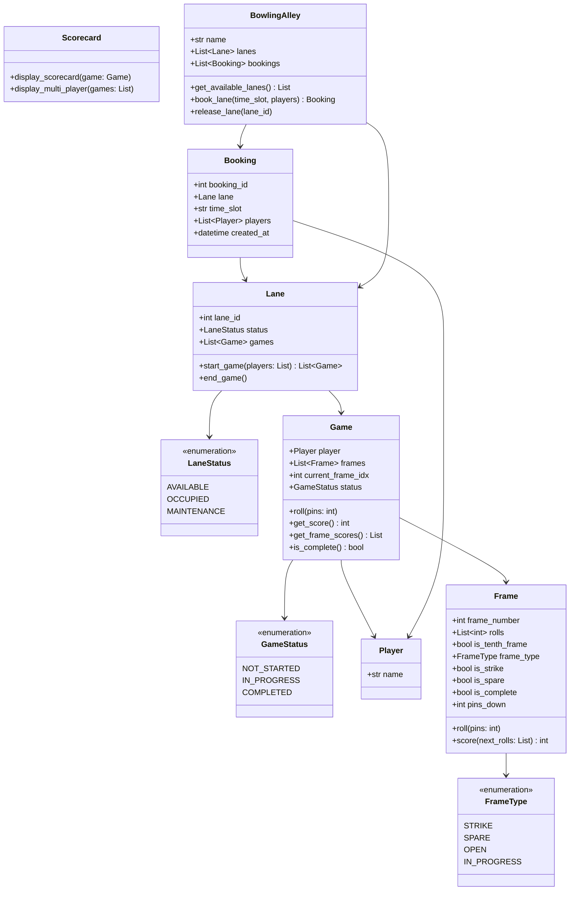

# Bowling Alley System - Machine Coding Round

## Problem Statement

Design and implement a **Bowling Alley Management System** that supports standard
10-pin bowling scoring, multiple lanes with booking, multiple players per game,
and formatted scorecard display.

**Time Limit:** 90 minutes

---

## Functional Requirements

### Core Features
1. **Bowling Alley Management**
   - Manage multiple lanes in the alley
   - Each lane can host one game at a time
   - Track lane status (AVAILABLE, OCCUPIED, MAINTENANCE)
   - Lane booking with time slots and player list

2. **Standard 10-Pin Bowling Scoring**
   - 10 frames per game
   - Each frame: up to 2 rolls to knock down 10 pins
   - **Strike**: All 10 pins in first roll
     - Score = 10 + next 2 rolls (bonus)
   - **Spare**: All 10 pins in 2 rolls
     - Score = 10 + next 1 roll (bonus)
   - **Open Frame**: Less than 10 pins in 2 rolls
     - Score = total pins knocked down
   - **10th Frame Special Rules**:
     - Strike in first roll: get 2 more rolls
     - Spare in first two rolls: get 1 more roll
     - Maximum 3 rolls in 10th frame

3. **Frame-by-Frame Score Tracking**
   - Running cumulative score after each frame
   - Mark strikes with "X" and spares with "/"
   - Handle pending bonus calculations

4. **Multiple Players**
   - Multiple players per lane/game
   - Players take turns frame by frame
   - Track individual scores and scorecards

5. **Scorecard Display**
   - Formatted scorecard showing:
     - Each frame with roll details
     - Running total per frame
     - Final score
   - Support for strike/spare notation

---

## Non-Functional Requirements

- Clean, modular OOP design
- Each class in a separate file
- Correct bonus calculation (strikes/spares)
- Proper handling of 10th frame edge cases
- Type hints and docstrings on all classes
- Error handling for invalid inputs (pins > remaining, etc.)

---

## Bowling Scoring Rules Reference

```
Frame 1-9:
  - 2 rolls maximum per frame
  - Strike (X): 10 pins in roll 1 -> bonus = next 2 rolls
  - Spare (/): 10 pins in rolls 1+2 -> bonus = next 1 roll
  - Open: < 10 pins total -> no bonus

Frame 10 (special):
  - Strike in roll 1: get rolls 2 and 3
  - Spare in rolls 1+2: get roll 3
  - Otherwise: only 2 rolls
  - NO bonus calculation for 10th frame strikes/spares
    (the extra rolls ARE the bonus)

Perfect Game: 12 strikes = 300 points
  Frame 1-9: 10 + 10 + 10 = 30 each = 270
  Frame 10: 10 + 10 + 10 = 30
  Total: 300

Scoring Example:
  Frame:  | 1  | 2  | 3  | 4  | 5  | 6  | 7  | 8  | 9  | 10    |
  Rolls:  |X   |7 / |3 4 |X   |2 / |X   |X   |X   |2 3 |X X X  |
  Score:  |20  |33  |40  |60  |80  |110 |132 |147 |152 |182     |
```

---

## Class Diagram



---

## Design Patterns Used

| Pattern    | Where                          | Why                                         |
|------------|--------------------------------|---------------------------------------------|
| State      | LaneStatus, GameStatus         | Lane and game lifecycle management          |
| Facade     | BowlingAlley                   | Single entry point for alley operations     |
| Iterator   | Frame iteration in Game        | Sequential frame processing                 |
| Observer   | Could extend for live display  | Update scorecard on each roll               |

---

## File Structure

```
Bowling-Alley/
├── README.md
└── code/
    ├── enums.py              # LaneStatus, FrameType, GameStatus
    ├── player.py             # Player with name
    ├── frame.py              # Frame with rolls, strike/spare detection, scoring
    ├── game.py               # Game with 10 frames, roll(), score calculation
    ├── scorecard.py          # Formatted scorecard display
    ├── lane.py               # Lane with status, current game
    ├── booking.py            # Booking with lane, time slot, players
    ├── bowling_alley.py      # BowlingAlley managing lanes and bookings
    └── demo.py               # Full game simulation with perfect game test
```

---

## Expected Input/Output

### Scenario: Two-Player Game

```
============================================================
         BOWLING ALLEY SIMULATION
============================================================

--- Setting Up ---
  Bowling Alley: "StrikeZone" (4 lanes)
  Available lanes: Lane 1, Lane 2, Lane 3, Lane 4

--- Booking Lane ---
  [+] Booked Lane 1 for 6:00 PM - 7:00 PM
  [+] Players: Alice, Bob

--- Game in Progress ---

Frame 1: Alice rolls 7, then 2 (Open: 9)
Frame 1: Bob rolls 10 (Strike!)

Frame 2: Alice rolls 10 (Strike!)
Frame 2: Bob rolls 8, then 2 (Spare!)

...

--- Final Scorecards ---
+------------------------------------------------------------+
|  ALICE's SCORECARD                                          |
+-----+-----+-----+-----+-----+-----+-----+-----+-----+-----+
|  1  |  2  |  3  |  4  |  5  |  6  |  7  |  8  |  9  | 10  |
| 7 2 | X   | 3 / | X   | X   | 8 1 | 6 / | X   | 9 / |X 8 1|
|  9  | 29  | 49  | 77  | 96  | 105 | 125 | 154 | 172 | 191 |
+-----+-----+-----+-----+-----+-----+-----+-----+-----+-----+
|  FINAL SCORE: 191                                           |
+------------------------------------------------------------+

--- Perfect Game Test (300) ---
  Roll 1: Strike!
  Roll 2: Strike!
  ...
  Roll 12: Strike!
+------------------------------------------------------------+
|  PERFECT PLAYER's SCORECARD                                 |
+-----+-----+-----+-----+-----+-----+-----+-----+-----+-----+
|  1  |  2  |  3  |  4  |  5  |  6  |  7  |  8  |  9  | 10  |
| X   | X   | X   | X   | X   | X   | X   | X   | X   |X X X|
| 30  | 60  | 90  | 120 | 150 | 180 | 210 | 240 | 270 | 300 |
+-----+-----+-----+-----+-----+-----+-----+-----+-----+-----+
|  FINAL SCORE: 300                                           |
+------------------------------------------------------------+

============================================================
         SIMULATION COMPLETE
============================================================
```

---

## Scoring Criteria

| Criteria                        | Marks | Description                                           |
|---------------------------------|-------|-------------------------------------------------------|
| **Working Code**                | 30    | Code compiles and runs without errors                 |
| **Scoring Accuracy**            | 25    | Correct strike/spare/10th frame bonus calculations    |
| **Code Quality / OOP**         | 20    | Clean classes, SRP, proper encapsulation              |
| **Scorecard Display**          | 10    | Well-formatted, readable scorecard output             |
| **Edge Cases**                 | 10    | Perfect game, gutter game, 10th frame specials        |
| **Extensibility**              | 5     | Easy to add tournament/league support                 |
| **Total**                       | **100** |                                                     |

---

## Edge Cases to Handle

1. **Perfect game** (all strikes): Score must be exactly 300
2. **Gutter game** (all zeros): Score must be 0
3. **All spares**: Correct bonus calculation throughout
4. **10th frame strike**: Must allow 2 additional rolls
5. **10th frame spare**: Must allow 1 additional roll
6. **Invalid pins**: Cannot knock down more than remaining pins
7. **Game already complete**: Reject additional rolls
8. **Multiple consecutive strikes**: Correct cascading bonus

---

## Common Scoring Mistakes to Avoid

- Not waiting for future rolls to calculate strike/spare bonuses
- Treating 10th frame the same as frames 1-9
- Not allowing 3 rolls in 10th frame after strike/spare
- Counting 10th frame bonus rolls toward next frame (there is no next frame)
- Off-by-one errors in frame counting

---

## Extension Ideas (if time permits)

- **League system**: Track scores across multiple games
- **Handicap scoring**: Adjusted scores based on skill level
- **Statistics**: Average score, strike percentage, spare conversion rate
- **Multiplayer tournament**: Bracket-style elimination
- **Lane maintenance scheduling**: Auto-flag lanes for maintenance

---

## How to Run

```bash
cd code/
python demo.py
```

---

## Key Concepts Tested

- Complex business logic (bowling scoring rules)
- State management (frame, game, lane)
- Formatted output / display logic
- Edge case handling (10th frame, perfect game)
- Clean code practices (SRP, type hints, docstrings)
- Object composition (Alley -> Lane -> Game -> Frame)
