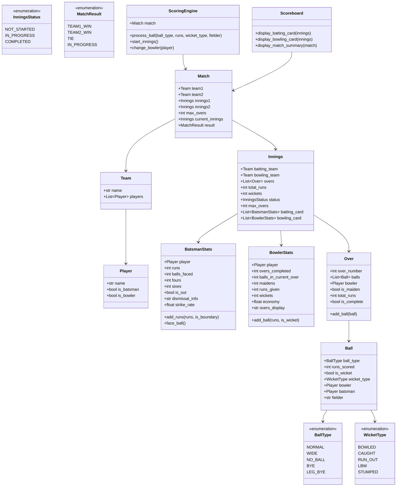

# Cricket Scoreboard - Machine Coding Round

## Problem Statement

Design and implement a **Cricket Scoreboard System** that tracks a cricket match
score in real-time, ball-by-ball. Support complete batsman and bowler statistics,
innings management, extras handling, and formatted scoreboard display.

**Time Limit:** 90 minutes

---

## Functional Requirements

### Core Features
1. **Match Management**
   - Support 2 teams with 11 players each
   - Two innings (Team A bats first, Team B chases)
   - Track current innings, batting team, bowling team
   - Determine match result (Team A wins / Team B wins / Tie)

2. **Ball-by-Ball Scoring**
   - Process each delivery with runs scored
   - Track ball type: NORMAL, WIDE, NO_BALL, BYE, LEG_BYE
   - Wide and No-Ball: extra run + ball does not count in over
   - Bye and Leg-Bye: runs scored but not credited to batsman
   - Automatically track overs (6 legal deliveries = 1 over)

3. **Wicket Handling**
   - Support wicket types: BOWLED, CAUGHT, RUN_OUT, LBW, STUMPED
   - Track which bowler took the wicket
   - Track fielder for CAUGHT and STUMPED
   - Innings ends when 10 wickets fall or overs completed

4. **Batsman Statistics**
   - Runs scored, balls faced
   - Number of 4s (boundaries) and 6s (sixes)
   - Strike rate: (runs / balls) * 100
   - Track current batsmen (striker and non-striker)
   - Rotate strike on odd runs and at end of over

5. **Bowler Statistics**
   - Overs bowled (completed.balls format, e.g., 3.4)
   - Maidens (over with 0 runs)
   - Runs conceded
   - Wickets taken
   - Economy rate: runs / overs

6. **Scoreboard Display**
   - Formatted batting card with all batsman stats
   - Formatted bowling card with all bowler stats
   - Match summary with score, overs, run rate
   - Current partnership details

---

## Non-Functional Requirements

- Clean, modular OOP design
- Each class in a separate file
- Proper state management for innings
- Formatted console output for scoreboard
- Type hints and docstrings on all classes
- Error handling for invalid inputs

---

## Class Diagram



---

## Design Patterns Used

| Pattern    | Where                          | Why                                         |
|------------|--------------------------------|---------------------------------------------|
| State      | InningsStatus, MatchResult     | Clean state transitions for match lifecycle |
| Observer   | Could extend for live updates  | Notify scoreboard on each ball              |
| Facade     | ScoringEngine                  | Single entry point for ball processing      |
| Builder    | Could use for Match setup      | Complex object creation                     |

---

## File Structure

```
Cricket-Scoreboard/
├── README.md
└── code/
    ├── enums.py              # WicketType, BallType, InningsStatus, MatchResult
    ├── player.py             # Player with name, batting/bowling flags
    ├── batsman_stats.py      # Runs, balls, 4s, 6s, strike rate
    ├── bowler_stats.py       # Overs, maidens, runs, wickets, economy
    ├── ball.py               # Single delivery with type, runs, wicket info
    ├── over.py               # Collection of balls forming an over
    ├── innings.py            # Full innings with batting/bowling cards
    ├── team.py               # Team with 11 players
    ├── match.py              # Match with 2 teams and 2 innings
    ├── scoreboard.py         # Formatted display of batting/bowling cards
    ├── scoring_engine.py     # Process each ball, update all stats
    └── demo.py               # Simulate 5 overs ball-by-ball
```

---

## Expected Input/Output

### Scenario: After Over 1

```
============================================================
         CRICKET SCOREBOARD SIMULATION
============================================================

--- Match: India vs Australia (5 overs per side) ---

=== INNINGS 1: India Batting ===

--- Over 1 (Bowler: Starc) ---
  Ball 1: Rohit scores 4 runs (FOUR!)
  Ball 2: Rohit scores 1 run (strike rotated)
  Ball 3: Kohli scores 0 runs (dot ball)
  Ball 4: WIDE! 1 extra run
  Ball 4: Kohli scores 2 runs
  Ball 5: Kohli scores 6 runs (SIX!)
  Ball 6: Kohli scores 1 run (strike rotated)

--- SCOREBOARD after Over 1 ---
+============================================+
|         INDIA INNINGS  -  14/0 (1 ov)      |
+============================================+
| BATTING                                     |
+---------------------------------------------+
| Batsman       R    B   4s  6s     SR        |
| Rohit *       5    2    1   0   250.00      |
| Kohli         9    4    0   1   225.00      |
+---------------------------------------------+
| Extras: 1 (wd: 1)                           |
| Total: 14/0 in 1.0 overs (RR: 14.00)       |
+---------------------------------------------+
| BOWLING                                     |
+---------------------------------------------+
| Bowler       O    M    R    W   ECON        |
| Starc       1.0   0   14    0  14.00       |
+---------------------------------------------+

...

=== MATCH RESULT ===
  India scored: 67/3 in 5.0 overs
  Australia scored: 58/4 in 5.0 overs
  India wins by 9 runs!

============================================================
         SIMULATION COMPLETE
============================================================
```

---

## Scoring Criteria

| Criteria                        | Marks | Description                                           |
|---------------------------------|-------|-------------------------------------------------------|
| **Working Code**                | 30    | Code compiles and runs without errors                 |
| **Completeness**                | 20    | All ball types, wickets, stats implemented            |
| **Code Quality / OOP**         | 20    | Clean classes, SRP, proper encapsulation              |
| **Scoreboard Display**         | 10    | Well-formatted, readable output                       |
| **Cricket Rules Accuracy**     | 10    | Correct handling of wides, no-balls, extras, strike   |
| **Error Handling**             | 5     | Handles edge cases                                    |
| **Extensibility**              | 5     | Easy to add DRS, powerplay, etc.                      |
| **Total**                       | **100** |                                                     |

---

## Edge Cases to Handle

1. Wide ball: +1 extra, ball does not count in over
2. No ball: +1 extra, ball does not count in over, free hit next
3. Bye/Leg-bye: runs added to total but NOT to batsman
4. All out (10 wickets) ends innings even if overs remain
5. Strike rotation: odd runs swap striker/non-striker
6. End of over: swap striker/non-striker, change bowler
7. 10th wicket: last batsman is not-out
8. Target chase: innings ends when target is exceeded

---

## Cricket Rules Quick Reference

- **Over**: 6 legal deliveries (wides and no-balls don't count)
- **Wide**: Ball too wide for batsman, 1 extra run, reball
- **No Ball**: Illegal delivery, 1 extra run, reball, free hit
- **Bye**: Runs off body/missed by all, extras (not batsman runs)
- **Leg Bye**: Runs off pads, extras (not batsman runs)
- **Maiden Over**: An over where 0 runs scored off the bat
- **Strike Rate**: (runs / balls faced) * 100
- **Economy Rate**: runs conceded / overs bowled

---

## Extension Ideas (if time permits)

- **DRS (Decision Review System)**: Overturn umpire decisions
- **Powerplay**: Different fielding restrictions per phase
- **Free Hit**: After no-ball, batsman cannot be bowled/LBW
- **Super Over**: Tie-breaker in limited overs
- **Commentary**: Auto-generate ball-by-ball commentary
- **Fall of Wickets**: Track score at each wicket

---

## How to Run

```bash
cd code/
python demo.py
```

---

## Key Concepts Tested

- Object-Oriented Design (composition, encapsulation)
- State management (innings state, match state)
- Domain modeling (cricket rules as code)
- Formatted output / display logic
- Clean code practices (SRP, type hints, docstrings)
