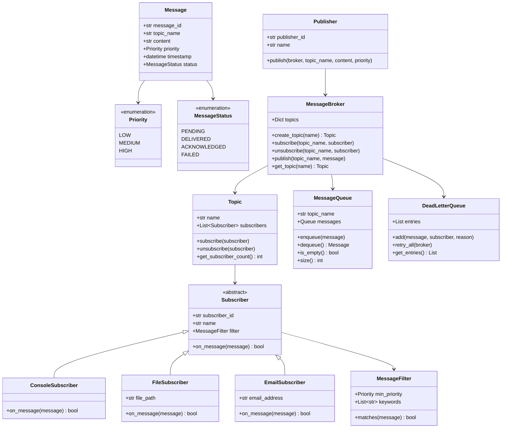

# Pub-Sub Messaging System - Machine Coding Round

## Problem Statement

Design and implement a **Publish-Subscribe (Pub-Sub) Messaging System** that allows
publishers to send messages to topics and delivers those messages to all subscribers
of that topic. Support message filtering, async delivery, dead letter queue, and
message acknowledgement.

**Time Limit:** 90 minutes

---

## Functional Requirements

### Core Features
1. **Topic Management**
   - Create named topics dynamically
   - List all existing topics
   - Each topic maintains its own subscriber list and message queue

2. **Publishing**
   - Publishers can publish messages to any existing topic
   - Messages have an ID, content, priority, and timestamp
   - Messages are delivered to ALL subscribers of a topic

3. **Subscribing**
   - Subscribers subscribe to one or more topics
   - Subscribers receive all messages published to their subscribed topics
   - Subscribers can unsubscribe from topics at any time
   - Support different subscriber types (Console, File, Email)

4. **Message Ordering**
   - Messages are delivered in the order they were published (per topic)
   - Each topic has its own ordered message queue

5. **Message Filtering**
   - Subscribers can optionally filter messages by:
     - Priority level (HIGH, MEDIUM, LOW)
     - Content keywords

6. **Async Delivery**
   - Messages are queued and delivered via background threads
   - Non-blocking publish operation

7. **Dead Letter Queue (DLQ)**
   - Failed message deliveries are moved to a Dead Letter Queue
   - DLQ stores the message, subscriber, and failure reason
   - Support retry from DLQ

8. **Message Acknowledgement**
   - Subscribers acknowledge message receipt
   - Unacknowledged messages can be redelivered

---

## Non-Functional Requirements

- Thread-safe operations
- Clean, modular OOP design
- Each class in a separate file
- Observer pattern for message delivery
- Proper error handling
- Type hints and docstrings on all classes

---

## Class Diagram



---

## Design Patterns Used

| Pattern    | Where                          | Why                                          |
|------------|--------------------------------|----------------------------------------------|
| Observer   | Topic/Subscriber               | Notify all subscribers when message published |
| Strategy   | MessageFilter                  | Pluggable filtering strategies                |
| Template   | Subscriber.on_message()        | Common interface, different implementations   |
| Singleton  | Could be used for Broker       | Central point of message management           |
| Queue      | MessageQueue                   | Ordered, async message delivery               |

---

## File Structure

```
Pub-Sub-System/
├── README.md
└── code/
    ├── enums.py                # Priority, MessageStatus enums
    ├── message.py              # Message class with id, content, priority
    ├── topic.py                # Topic with subscriber management
    ├── publisher.py            # Publisher that sends messages to broker
    ├── subscriber.py           # Abstract Subscriber interface
    ├── concrete_subscribers.py # Console, File, Email subscriber implementations
    ├── message_broker.py       # Central broker orchestrating pub-sub
    ├── message_queue.py        # Per-topic ordered message queue
    ├── message_filter.py       # Filter messages by priority/keywords
    ├── dead_letter_queue.py    # Store and retry failed deliveries
    └── demo.py                 # Full executable simulation
```

---

## Expected Input/Output

### Scenario: Full Pub-Sub Lifecycle

```
============================================================
         PUB-SUB MESSAGING SYSTEM SIMULATION
============================================================

--- Creating Topics ---
  [+] Topic created: "sports"
  [+] Topic created: "technology"
  [+] Topic created: "finance"

--- Registering Subscribers ---
  [+] ConsoleSubscriber "Alice" created
  [+] ConsoleSubscriber "Bob" created
  [+] FileSubscriber "FileLogger" created -> /tmp/pubsub.log
  [+] EmailSubscriber "EmailAlert" created -> admin@example.com

--- Subscribing to Topics ---
  [+] Alice subscribed to "sports"
  [+] Alice subscribed to "technology"
  [+] Bob subscribed to "sports"
  [+] FileLogger subscribed to "technology"
  [+] EmailAlert subscribed to "finance" (filter: HIGH priority only)

--- Publishing Messages ---
  [>] Published to "sports": "India wins the World Cup!" (HIGH)
  [>] Published to "technology": "New Python 4.0 released" (MEDIUM)
  [>] Published to "finance": "Market hits all-time high" (HIGH)
  [>] Published to "finance": "Quarterly results announced" (LOW)

--- Message Delivery ---
  [Alice] Received on sports: "India wins the World Cup!" (HIGH)
  [Bob] Received on sports: "India wins the World Cup!" (HIGH)
  [Alice] Received on technology: "New Python 4.0 released" (MEDIUM)
  [FileLogger] Written to file: "New Python 4.0 released"
  [EmailAlert] Email sent to admin@example.com: "Market hits all-time high"
  [EmailAlert] FILTERED OUT: "Quarterly results announced" (LOW < HIGH)

--- Unsubscribe Demo ---
  [-] Alice unsubscribed from "sports"
  [>] Published to "sports": "New IPL season announced" (MEDIUM)
  [Bob] Received on sports: "New IPL season announced"
  (Alice did NOT receive this message)

--- Dead Letter Queue ---
  [!] 0 messages in Dead Letter Queue

--- Message Queue Stats ---
  sports: 2 messages processed
  technology: 1 messages processed
  finance: 2 messages processed

============================================================
         SIMULATION COMPLETE
============================================================
```

---

## Scoring Criteria

| Criteria                        | Marks | Description                                           |
|---------------------------------|-------|-------------------------------------------------------|
| **Working Code**                | 30    | Code compiles and runs without errors                 |
| **Completeness**                | 20    | All requirements implemented                          |
| **Code Quality / OOP**         | 20    | Clean classes, SRP, proper abstractions               |
| **Design Patterns**            | 10    | Correct use of Observer, Strategy, etc.               |
| **Thread Safety**              | 10    | Async delivery, no race conditions                    |
| **Error Handling**             | 5     | Handles edge cases (no topic, duplicate sub, etc.)    |
| **Extensibility**              | 5     | Easy to add new subscriber types, filters             |
| **Total**                       | **100** |                                                     |

---

## Edge Cases to Handle

1. Publish to non-existent topic -> Create topic or raise error
2. Subscribe to non-existent topic -> Create topic or raise error
3. Unsubscribe when not subscribed -> Handle gracefully
4. Duplicate subscription -> Prevent or ignore
5. Subscriber throws exception during on_message -> Catch and send to DLQ
6. Empty message content -> Reject with error
7. Filter out all messages -> Subscriber receives nothing (valid scenario)

---

## Extension Ideas (if time permits)

- **Message TTL**: Messages expire after a configurable time
- **Replay**: Subscribers can replay messages from a topic's history
- **Partitioning**: Split topic into partitions for parallel processing
- **Subscriber groups**: Load-balance messages across subscriber group
- **Persistent storage**: Save messages to disk for durability
- **Backpressure**: Slow down publishers when subscribers are overwhelmed

---

## How to Run

```bash
cd code/
python demo.py
```

---

## Key Concepts Tested

- Object-Oriented Design (abstraction, polymorphism)
- Design Patterns (Observer, Strategy, Template Method)
- Concurrent programming (threading, thread safety)
- Queue data structures
- Error handling and fault tolerance
- Clean code practices (SRP, type hints, docstrings)
