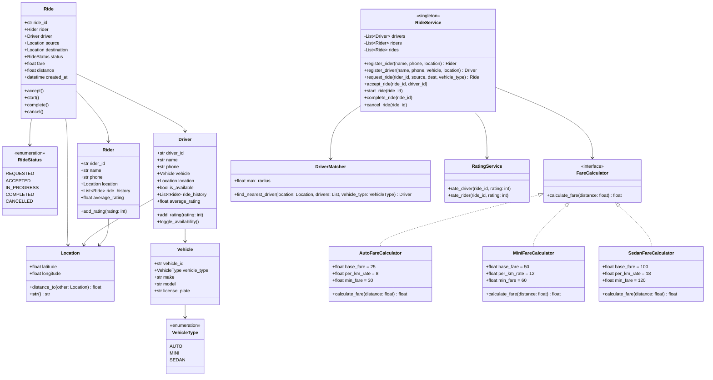

# Ride-Sharing System - Machine Coding Round

## Problem Statement

Design and implement a **Ride-Sharing System** (like Uber/Ola) that allows riders to request
rides, matches them with nearby available drivers, calculates fares, and tracks ride lifecycle.

**Time Limit:** 90 minutes

---

## Functional Requirements

### Core Features
1. **Rider Management**
   - Riders can register with name, phone number, and current location
   - Riders can request a ride by specifying source and destination
   - Riders can view their ride history
   - Riders can rate drivers after ride completion

2. **Driver Management**
   - Drivers can register with name, phone, vehicle info, and current location
   - Drivers can toggle their availability (online/offline)
   - Drivers can accept or reject ride requests
   - Drivers can view their ride history and average rating

3. **Ride Lifecycle**
   - A ride goes through the following states:
     ```
     REQUESTED -> ACCEPTED -> IN_PROGRESS -> COMPLETED
                                           -> CANCELLED (at any point before COMPLETED)
     ```
   - Only one active ride per rider at a time
   - Only one active ride per driver at a time

4. **Driver Matching**
   - When a rider requests a ride, find the nearest available driver within a configurable radius
   - Driver must be available (not on another ride)
   - Match considers vehicle type preference if specified

5. **Fare Calculation**
   - Fare depends on distance and vehicle type
   - Different rate cards for different vehicle types:
     - **Auto**: Base fare Rs 25 + Rs 8/km
     - **Mini**: Base fare Rs 50 + Rs 12/km
     - **Sedan**: Base fare Rs 100 + Rs 18/km
   - Minimum fare applies per vehicle type

6. **Rating System**
   - Both rider and driver can rate each other (1-5 stars)
   - Rating only allowed after ride is COMPLETED
   - Average rating maintained for both parties

---

## Non-Functional Requirements

- Clean, modular OOP design
- Each class in a separate file
- Strategy pattern for fare calculation
- Singleton pattern for ride service
- Proper error handling with meaningful messages
- Type hints on all methods
- Docstrings on all classes

---

## Class Diagram



---

## Design Patterns Used

| Pattern    | Where                            | Why                                      |
|------------|----------------------------------|------------------------------------------|
| Strategy   | FareCalculator                   | Different fare logic per vehicle type     |
| Singleton  | RideService                      | Single point of ride management           |
| Observer   | Could extend for notifications   | Notify driver/rider on status change      |
| State      | RideStatus transitions           | Clean state management for ride lifecycle |

---

## File Structure

```
Ride-Sharing/
├── README.md
└── code/
    ├── enums.py              # VehicleType, RideStatus enumerations
    ├── location.py           # Location class with distance calculation
    ├── vehicle.py            # Vehicle class with type, make, model
    ├── rider.py              # Rider class with profile and history
    ├── driver.py             # Driver class with vehicle and availability
    ├── ride.py               # Ride class with lifecycle management
    ├── fare_calculator.py    # Strategy pattern: Auto/Mini/Sedan fare
    ├── driver_matcher.py     # Find nearest available driver
    ├── ride_service.py       # Singleton service orchestrating rides
    ├── rating_service.py     # Rating management for riders/drivers
    └── demo.py               # Full executable simulation
```

---

## Expected Input/Output

### Scenario: Full Ride Lifecycle

```
============================================================
         RIDE-SHARING SYSTEM SIMULATION
============================================================

--- Registering Drivers ---
[+] Driver registered: Amit (Auto - KA01AB1234)
[+] Driver registered: Priya (Mini - KA01CD5678)
[+] Driver registered: Ravi (Sedan - KA01EF9012)

--- Registering Riders ---
[+] Rider registered: John (Phone: 9876543210)
[+] Rider registered: Jane (Phone: 9876543211)

--- John Requests a Mini Ride ---
[*] Finding nearest MINI driver for John...
[*] Nearest driver: Priya (2.3 km away)
[*] Ride R001 created: REQUESTED
[*] Fare estimate: Rs 86.60

--- Driver Priya Accepts the Ride ---
[*] Ride R001: REQUESTED -> ACCEPTED

--- Ride Starts ---
[*] Ride R001: ACCEPTED -> IN_PROGRESS

--- Ride Completed ---
[*] Ride R001: IN_PROGRESS -> COMPLETED
[*] Final fare: Rs 86.60

--- Rating ---
[*] John rates Priya: 5 stars
[*] Priya rates John: 4 stars
[*] Priya's average rating: 5.0
[*] John's average rating: 4.0

--- Ride History ---
John's rides:
  Ride R001 | Mini | Rs 86.60 | COMPLETED
Jane's rides:
  (No rides yet)

--- Jane Requests an Auto Ride ---
[*] Finding nearest AUTO driver for Jane...
[*] Nearest driver: Amit (1.5 km away)
...

============================================================
         SIMULATION COMPLETE
============================================================
```

---

## Scoring Criteria

| Criteria                        | Marks | Description                                           |
|---------------------------------|-------|-------------------------------------------------------|
| **Working Code**                | 30    | Code compiles and runs without errors                 |
| **Completeness**                | 20    | All requirements implemented                          |
| **Code Quality / OOP**         | 20    | Clean classes, SRP, proper encapsulation              |
| **Design Patterns**            | 10    | Correct use of Strategy, Singleton, etc.              |
| **Error Handling**             | 10    | Handles edge cases (no driver, invalid state, etc.)   |
| **Code Readability**           | 5     | Naming, comments, formatting                          |
| **Extensibility**              | 5     | Easy to add new vehicle types, fare strategies        |
| **Total**                       | **100** |                                                     |

---

## Edge Cases to Handle

1. No available driver within radius -> Return appropriate error message
2. Rider already has an active ride -> Reject new ride request
3. Driver already on a ride -> Skip during matching
4. Invalid state transitions (e.g., complete a ride that is not IN_PROGRESS)
5. Rating outside 1-5 range -> Reject with error
6. Rating before ride is completed -> Reject with error
7. Cancel an already completed ride -> Reject with error

---

## Extension Ideas (if time permits)

- **Surge pricing**: Multiply fare by a surge factor during peak hours
- **Ride pooling**: Multiple riders share a ride
- **Driver preference**: Let rider choose specific driver
- **ETA calculation**: Estimate time of arrival based on distance and speed
- **Notifications**: Observer pattern to notify on ride status change
- **Promo codes**: Discount on fare with coupon codes

---

## How to Run

```bash
cd code/
python demo.py
```

---

## Key Concepts Tested

- Object-Oriented Design (classes, encapsulation, inheritance)
- Design Patterns (Strategy, Singleton)
- State management (ride lifecycle)
- Geospatial basics (distance calculation)
- Clean code practices (SRP, type hints, docstrings)
- Error handling and edge cases
